## terraform init:

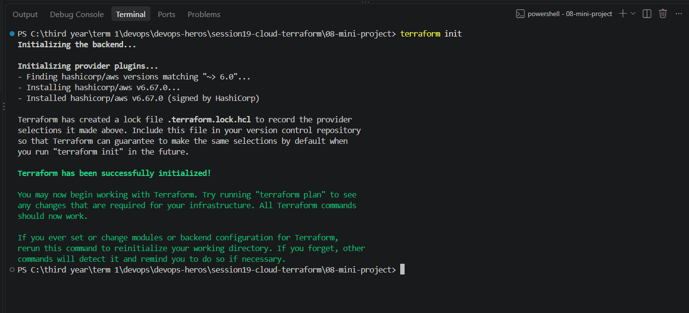

## terraform fmt:
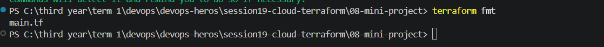

## terraform validate:
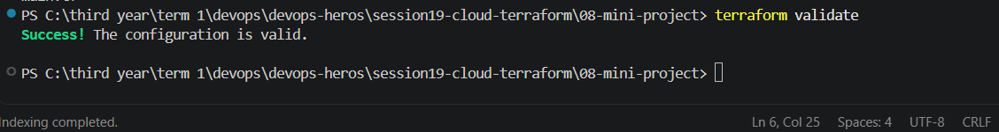

## terraform plan:
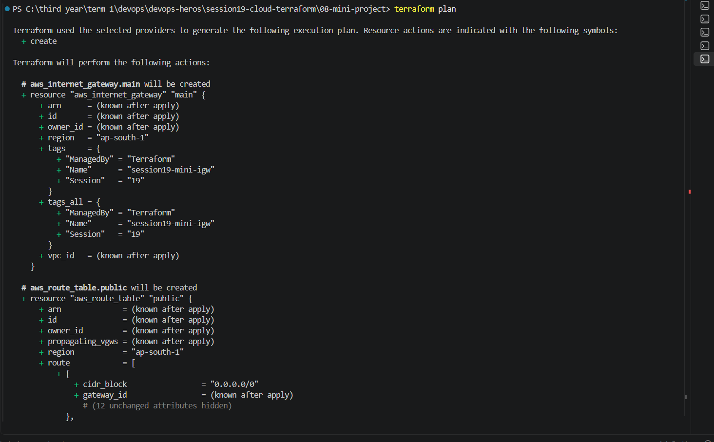

## terraform apply :
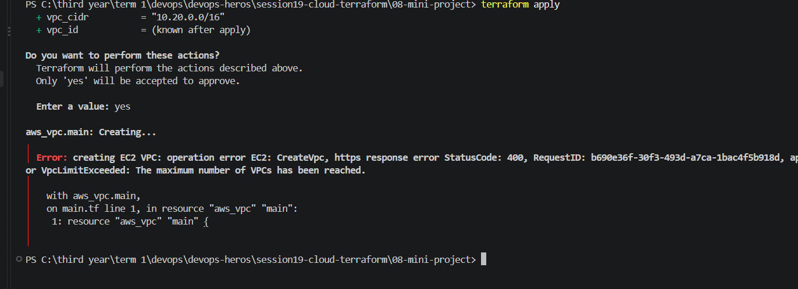

### then we updated the region to us-west-1 in variables.tf
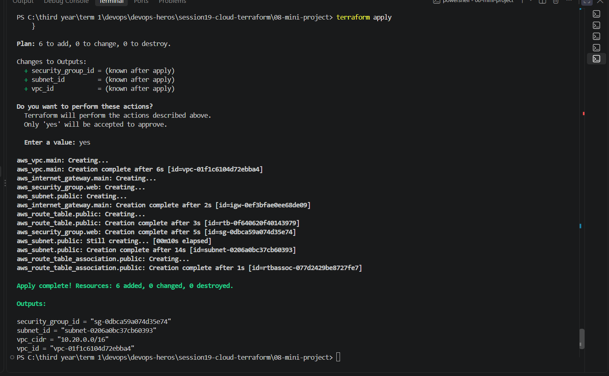

## terraform plan -destroy  
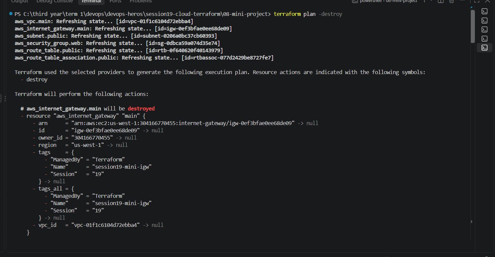

## terraform destory
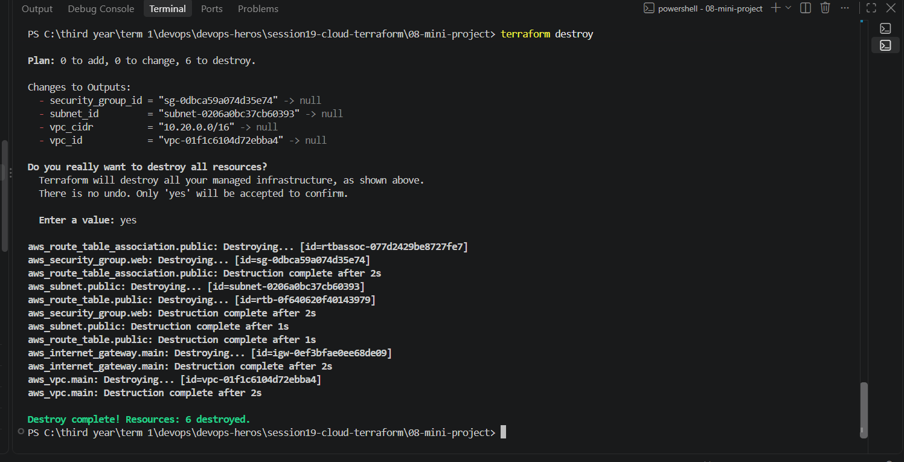

## terraform show :
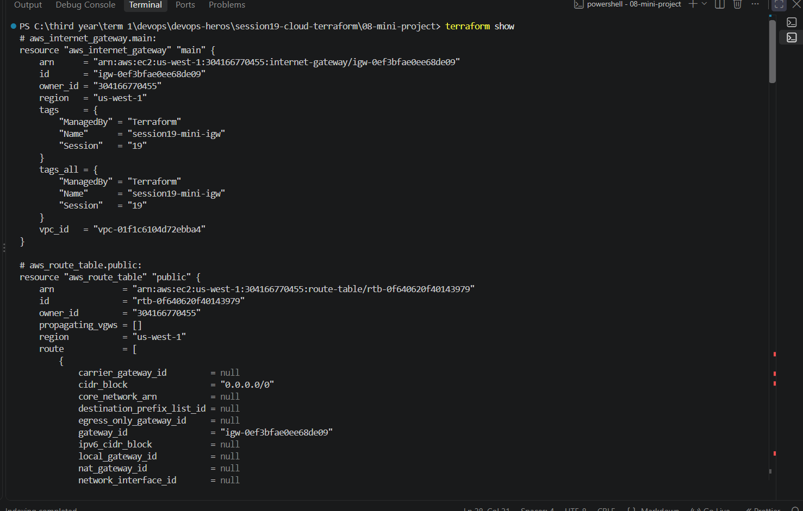

## terraform state list :
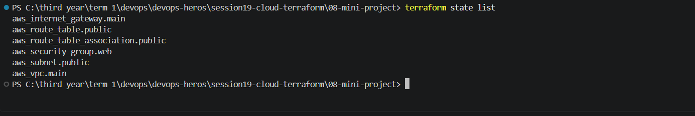

## aws configure list :
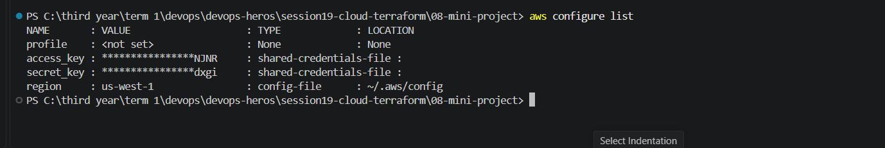

