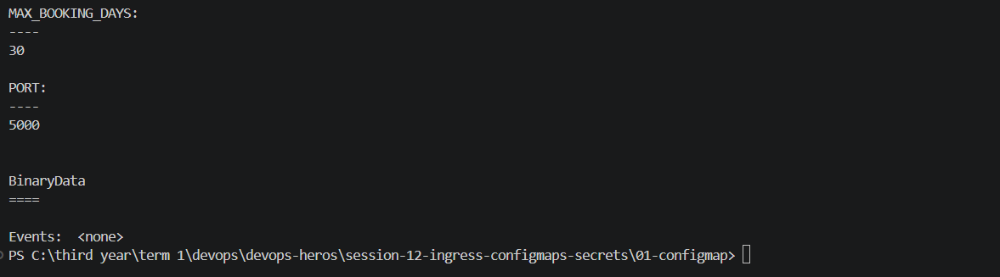
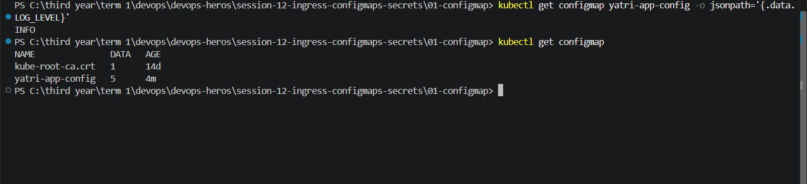
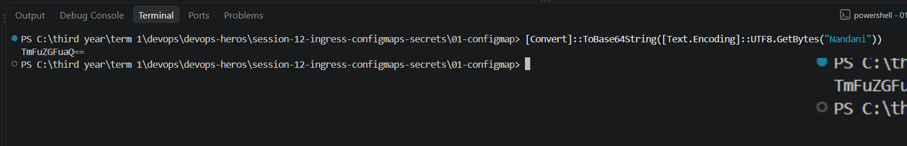
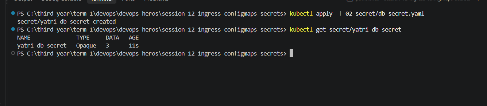
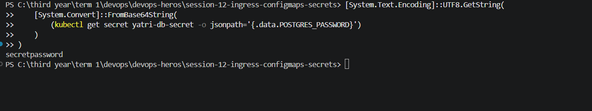
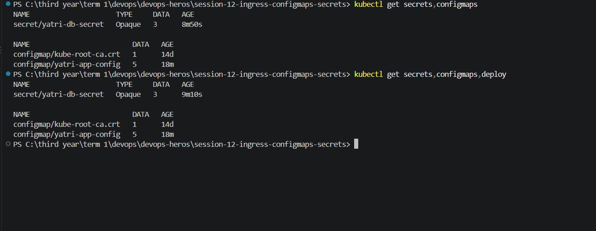

## ConfigMap:

## Readning a configmap:

## DB_SECRET:
### Generating Base64 Values Yourself:

` [Convert]::ToBase64String([Text.Encoding]::UTF8.GetBytes("Nandani"))`

## Apply and inspect :

##  Decode a Secret Value (for debugging):
`[System.Text.Encoding]::UTF8.GetString(
    [System.Convert]::FromBase64String(
        (kubectl get secret yatri-db-secret -o jsonpath='{.data.POSTGRES_PASSWORD}')
    )
)`

### kubectl get secrets,configmaps :

