# Running canary :
## app-stable 
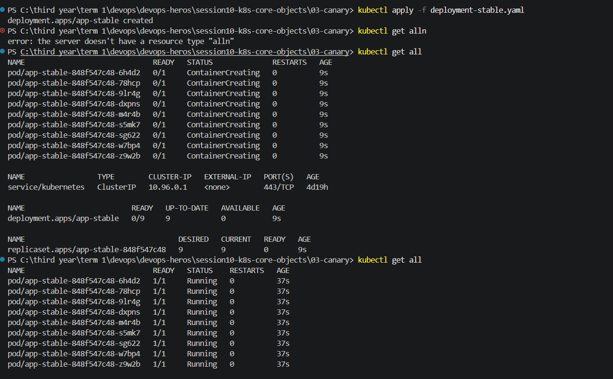

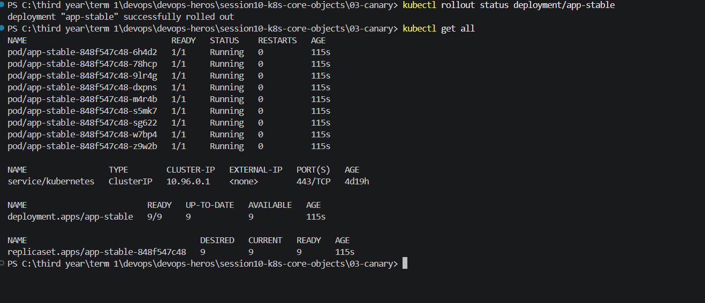

## creating service :
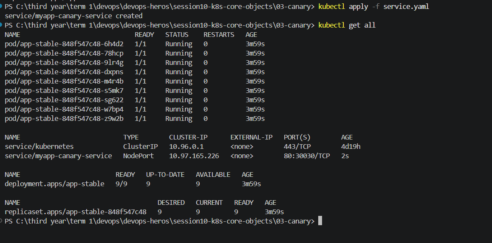

## Test — All Traffic Goes to Stable v1

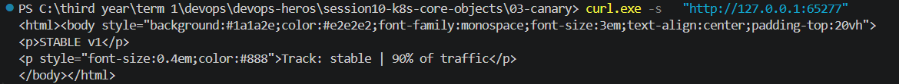

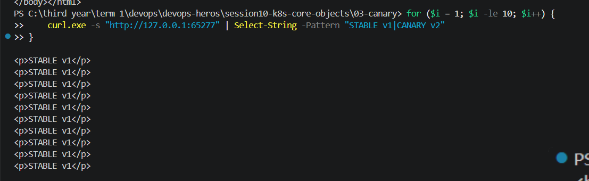

## Deploying Canary , and checking the labels :
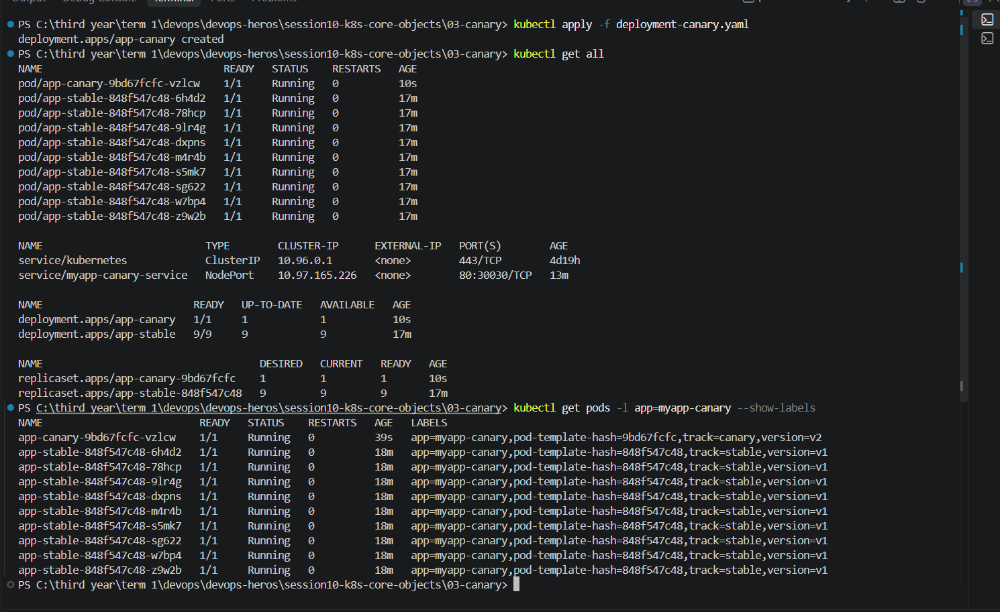

## Verifying Traffic Split in Real Time
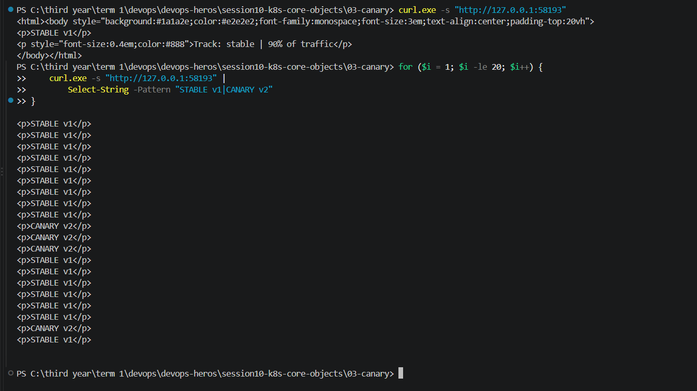

## Increasing Canary Traffic to 30% (3 out of 10 Pods)
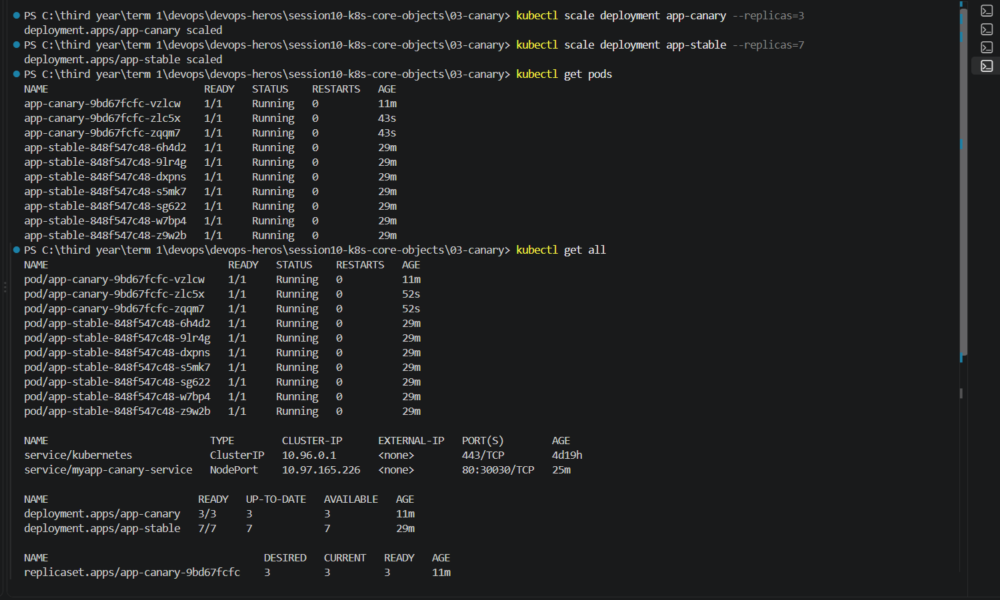

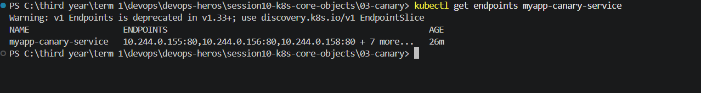

### Re-run the traffic test:
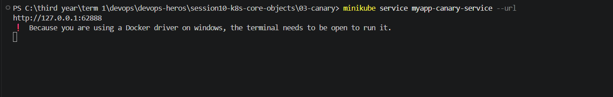

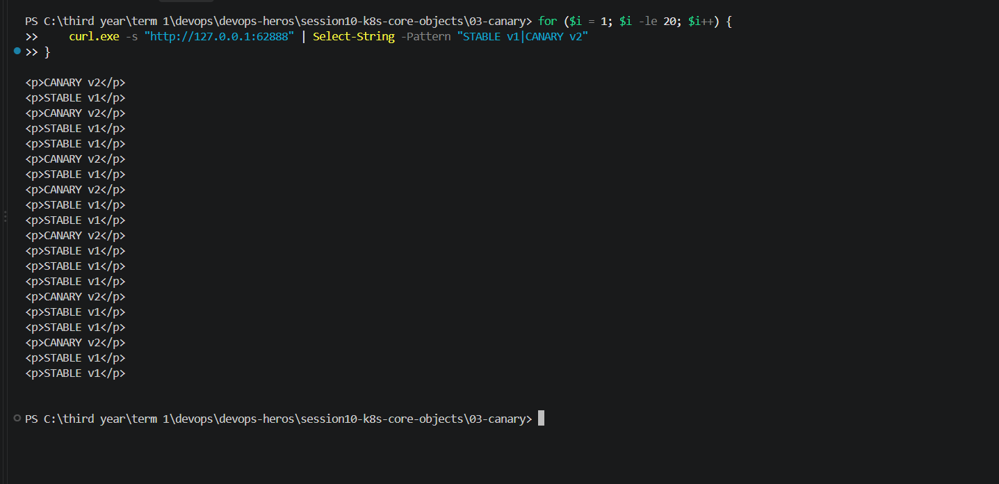

## Promote Canary to 100% (Canary is Healthy)
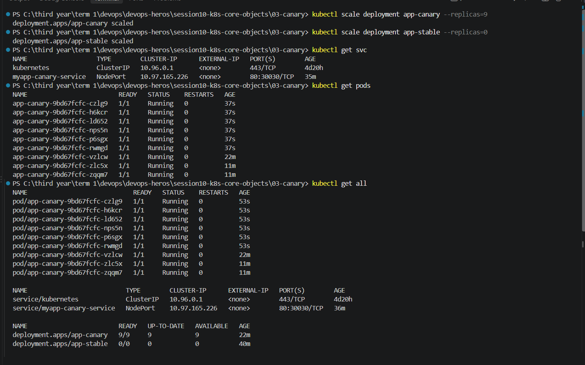

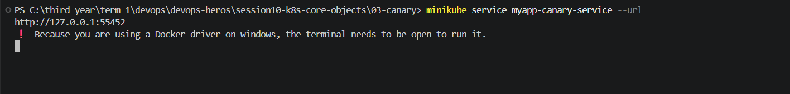
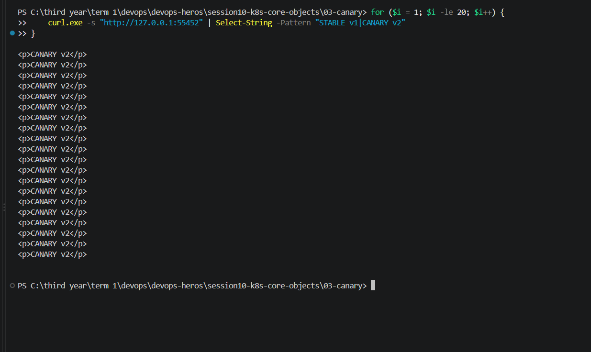

## clean up old stable deployment
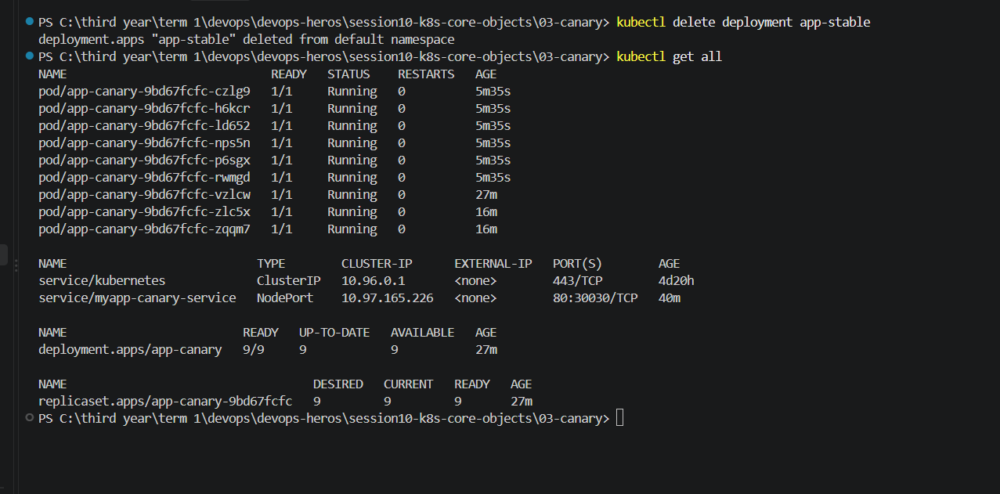

## Rollback Canary (Canary is Broken): 

`as in step 7A we deleted all the stable deployments`
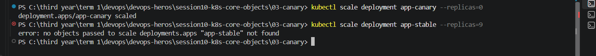

## Cleanup :
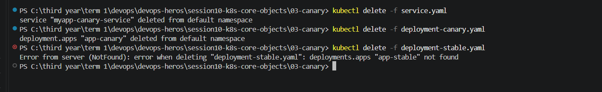