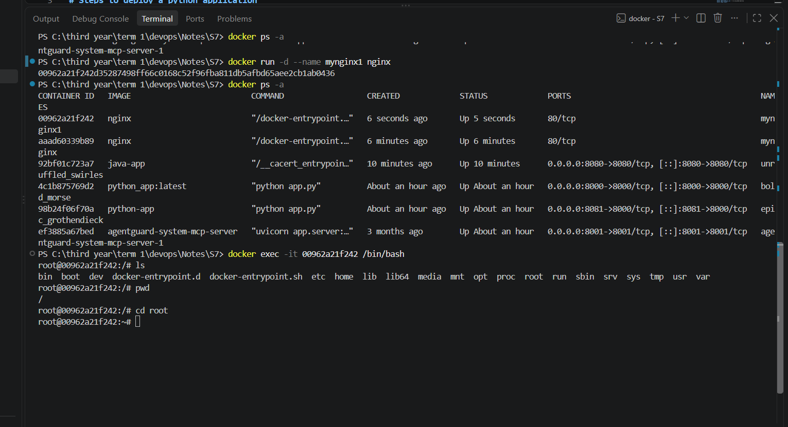

# Docker Multi-Stage Build Homework

## Student Details

- Name: `Your Name Here`
- Enrollment Number: `Your Enrollment Number Here`

## Task 1: Run Multi-Stage Dockerfile

### Objective

- Clone the repository containing the multi-stage Dockerfile.
- Build the Docker image using the multi-stage Dockerfile.
- Run a container from the image.
- Access the application running inside the container.
- Verify that the application displays:

```text
Hello World from Docker multi-stage build
```

- Verify the running container using `docker ps`.
- Confirm that the application is running on port `8080`.

### Commands Used

```bash
git clone <repository-url>
cd <repository-folder>
docker build -t multi-stage-app .
docker run -d -p 8080:8080 --name multi-stage-container multi-stage-app
docker ps
```

### Evidence

Replace the placeholders below with your own screenshots or command output after running the task.




## Task 2: Documentation

This section documents the successful completion of Task 1.

- Application output verified
- `docker ps` verified
- Port `8080` verified

## Task 3: Docker Application Deployment

### Objective

Deploy at least 3 different types of applications using Docker:

- Node.js
- Python
- Java

### Applications

#### Node.js

- Source files:
  - [`node_app/app.js`](node_app/app.js)
  - [`node_app/Dockerfile`](node_app/Dockerfile)
- Behavior:
  - Runs a Node.js HTTP server on port `3000`
  - Responds with `Hello world from Node.js!`
- Status: Implemented in this repository

#### Python

- Source files:
  - [`python_app/app.py`](python_app/app.py)
  - [`python_app/Dockerfile`](python_app/Dockerfile)
- Behavior:
  - Runs a Python HTTP server on port `8000`
  - Responds with `Hello world from Python!`
- Status: Implemented in this repository

#### Java

- Source files:
  - [`java_app/JavaServer.java`](java_app/JavaServer.java)
  - [`java_app/Dockerfile`](java_app/Dockerfile)
- Behavior:
  - Runs a Java HTTP server on port `8080`
  - Responds with `Hello World from Java Server!`
- Status: Implemented in this repository

### Evidence

Use the source files above as the basis for screenshots or command outputs when documenting the deployment.

Recommended verification commands:

```bash
cd node_app
docker build -t node-app .
docker run -d -p 3000:3000 node-app

cd ../python_app
docker build -t python-app .
docker run -d -p 8000:8000 python-app

cd ../java_app
docker build -t java-app .
docker run -d -p 8080:8080 java-app
```

## Submission

- This Markdown file is placed inside the `Docker_Fundamentals` folder.
- It contains the required documentation for the multi-stage build homework.
- Replace placeholder names, enrollment details, and screenshots before submission.
