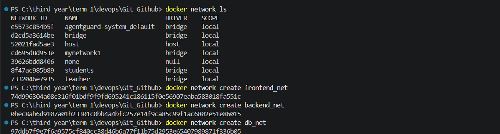
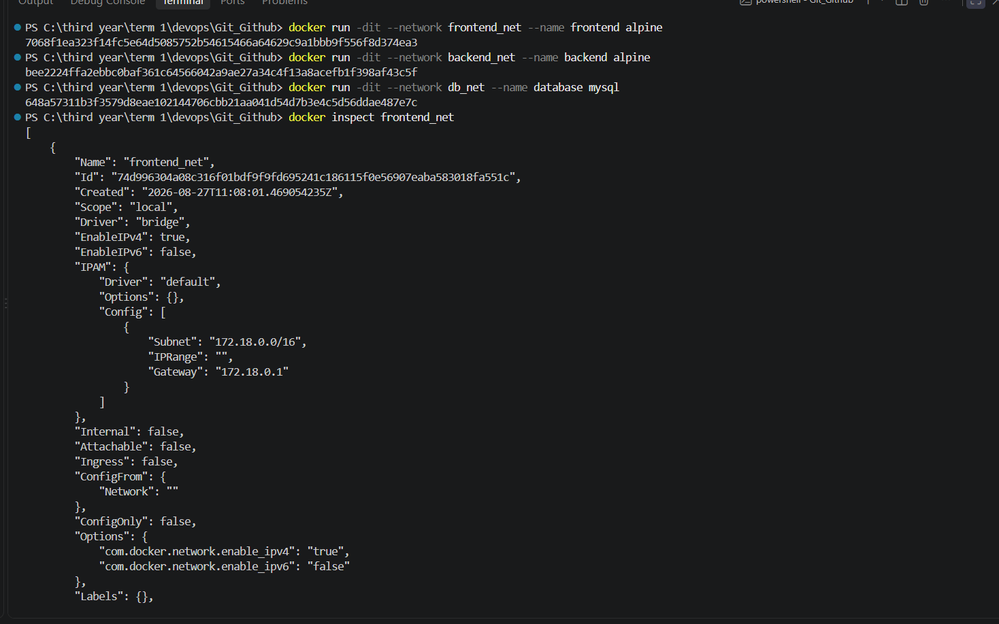
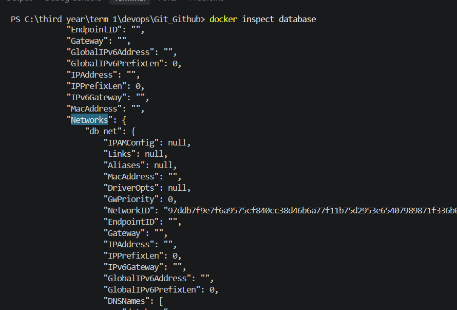
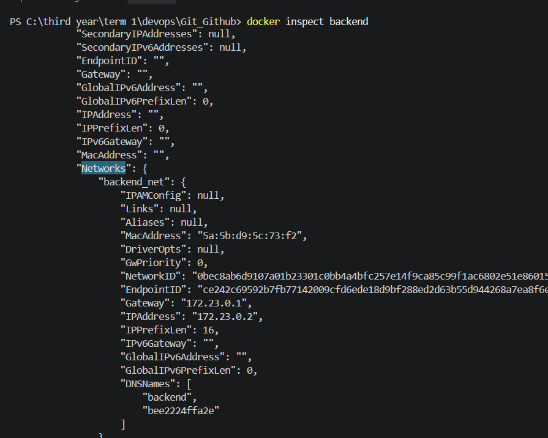
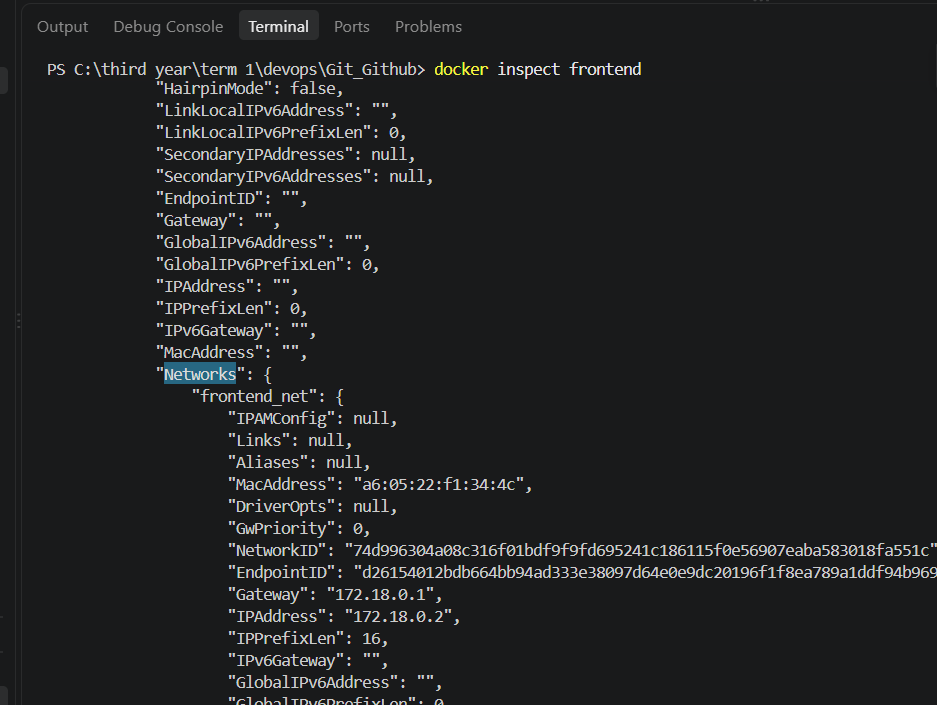
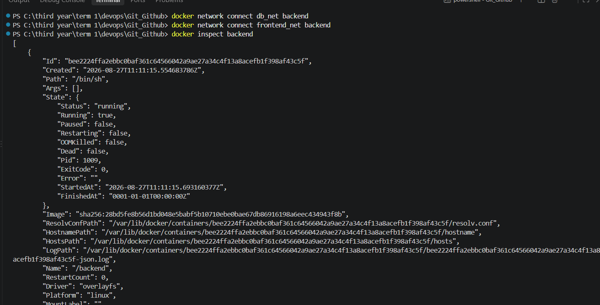
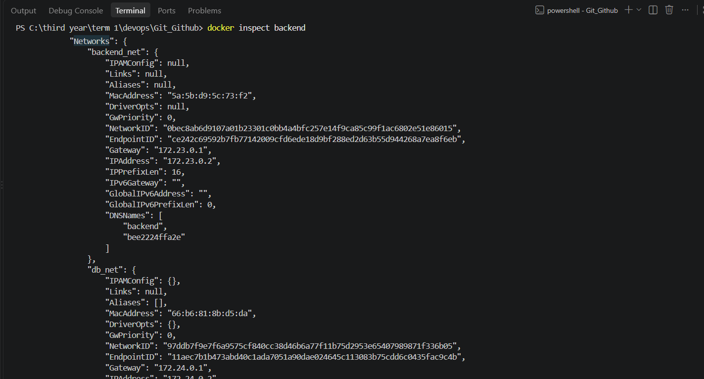
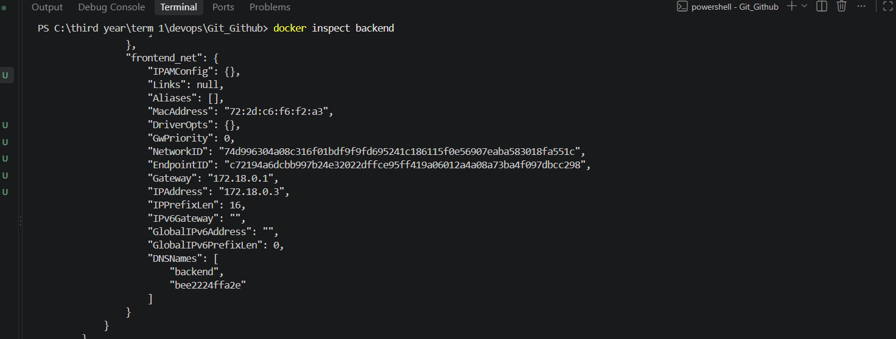

# Creating networks: 

# Runnning containers 

# Checking current network and container connection :

## database container : 

## backend container: 

## frontend container:

# Connecting backend with frontend and db networks :

# Inspecting the connections :

