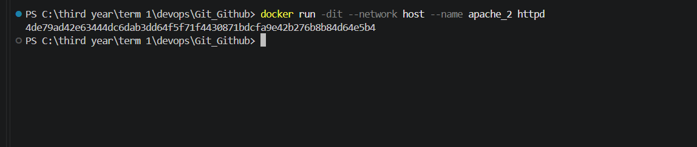
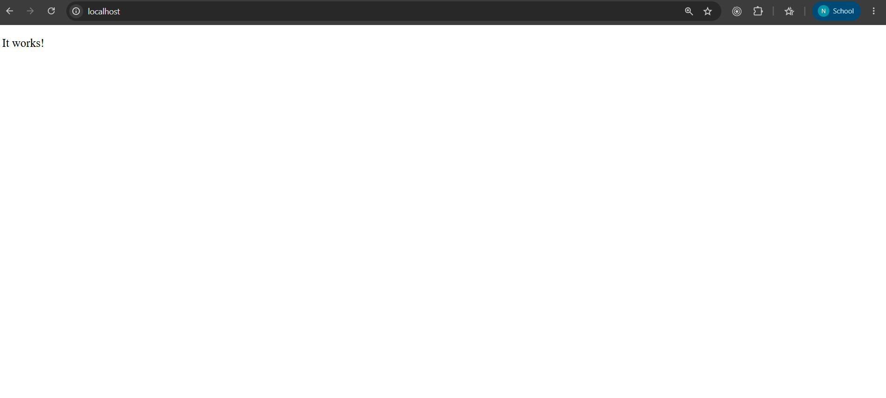
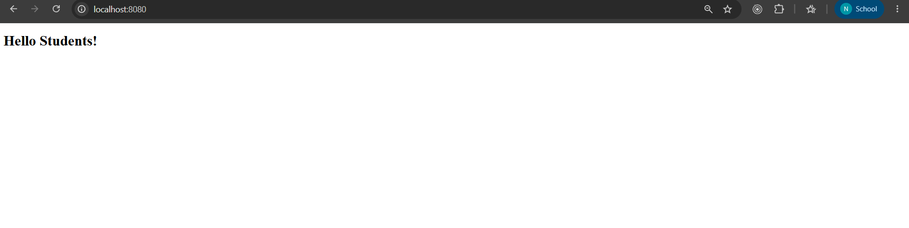
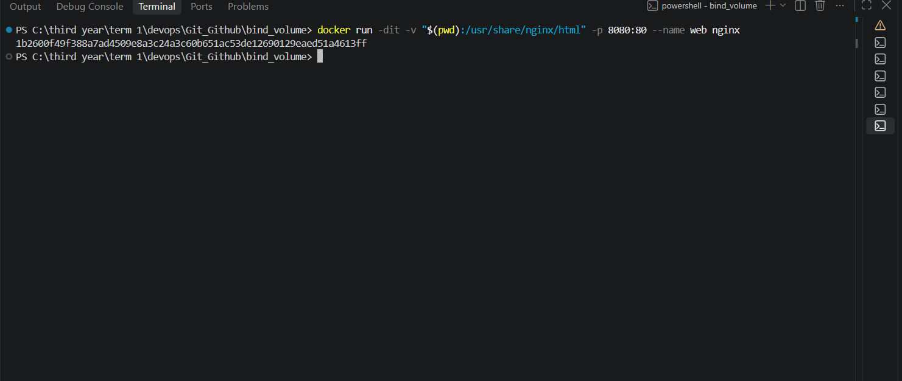
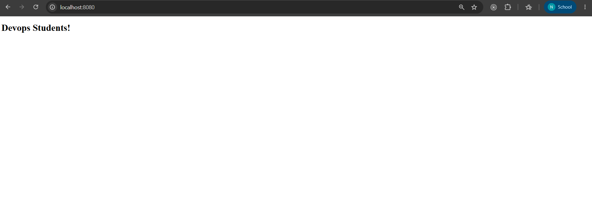

# Docker Networking & Volume Homework

This repository contains the completed homework for:

- Docker container networking
- Host network mode
- Bind mounts
- Overlay network research

Repository branch: `homeworks`

## Repository Layout

- `Frontend_backend_db_networks.md` - Task 1 notes and screenshots
- `apache_host_network.md` - Task 2 notes and screenshots
- `bind_volume/README.md` - Task 3 notes and screenshots
- `../Docker_Fundamentals/` - earlier Docker practice apps and Dockerfiles

## Task 1: Docker Container Networking

Goal:

- Create 3 containers:
  - Frontend
  - Backend
  - Database
- Use Nginx or Alpine images for frontend and backend
- Use the MySQL image for the database
- Create 3 different Docker networks
- Add the backend container to 2 networks
- Check connectivity between the containers

Implementation notes:

- The task evidence is stored in [`Frontend_backend_db_networks.md`](Frontend_backend_db_networks.md)
- The backend container is shown connected to both the frontend and database networks
- Network inspection and container connectivity checks are included in the screenshots below

Screenshots:

## Task 2: Host Network

Goal:

- Pull the Apache2 image from Docker Hub
- Create an Apache2 container using the host network
- Access the Apache website directly on port 80

Implementation notes:

- The task evidence is stored in [`apache_host_network.md`](apache_host_network.md)
- The container is run with host networking so the Apache service is reachable directly from the host on port 80

Screenshots:

## Task 3: Bind Mount

Goal:

- Create a folder on the local machine
- Create an `index.html` file with `Hello students` as the content
- Bind mount the folder to an Nginx container
- Access the Nginx website and verify the content
- Modify the `index.html` file
- Verify that the changes are reflected without restarting the container

Implementation notes:

- The task evidence is stored in [`bind_volume/README.md`](bind_volume/README.md)
- The bind mount keeps the HTML file live, so updates on the host appear immediately in the running Nginx container

Screenshots:

## Task 4: Overlay Network

Research summary:

- Docker overlay networks connect containers across multiple Docker hosts
- They are typically used in swarm-style or multi-host deployments
- Overlay networking lets services communicate as if they were on the same private network, even when the containers run on different machines
- Common use cases include microservices, distributed applications, and clustered deployments

Notes:

- This task is research-based in this repository
- No execution screenshots are included for this section

## Submission Checklist

- [x] Task 1 networking completed and documented
- [x] Task 2 host network completed and documented
- [x] Task 3 bind mount completed and documented
- [x] Task 4 overlay network researched and summarized
- [x] Screenshots added to the repository and embedded in this README

## Additional Files

The following practice apps are available in the repository:

- `../Docker_Fundamentals/python_app`
- `../Docker_Fundamentals/node_app`
- `../Docker_Fundamentals/apache_app`
- `../Docker_Fundamentals/java_app`

These are separate from the homework tasks, but they remain in the repo as supporting Docker practice material.
