# Session 13: Kubernetes Storage, HPA & Probes

---

## 📋 Task Overview & Deliverables

| Deliverable | Status | Description |
| :--- | :---: | :--- |
| **Volume Documentation** | ✅ Done | In-depth documentation of `emptyDir`, `hostPath`, `PV`, `PVC`, `StorageClass`, and Dynamic Provisioning with practical examples. |
| **HPA YAML** | ✅ Done | Autoscaler configured with target 50% CPU, min 1, max 5 replicas. |
| **Load Generator** | ✅ Done | Multi-worker background traffic spike simulation. |
| **HPA Output** | ✅ Done | Live terminal metrics: CPU utilization surge (0% $\rightarrow$ 197%) and pod auto-scaling (1 $\rightarrow$ 4 $\rightarrow$ 5 replicas). |
| **Screenshots** | ✅ Done | Embedded terminal captures for every single phase. |
| **Mini-Project Implementation** | ✅ Done | Production-grade web app combining PVC persistence, Startup/Readiness/Liveness probes, and HPA. |
| **README Documentation** | ✅ Done | Complete unified reference guide. |

---

## 🛠️ Cluster Environment & Prerequisites

Before executing the tasks, the Kubernetes cluster and Metrics Server were verified:

```bash
kubectl get nodes
kubectl get storageclass
kubectl top nodes
```

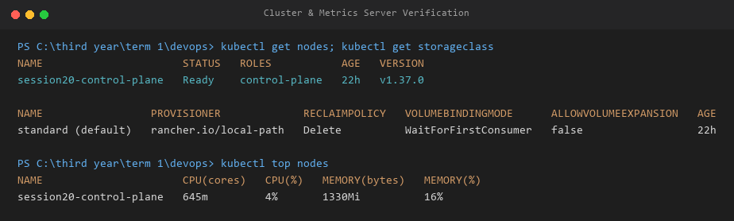

---

## 🚀 Task 1: Kubernetes Volumes

Documenting everything learned about Kubernetes volume types, storage lifecycle, and practical YAML implementations.

### 1.1 `emptyDir`

#### What is it?
An `emptyDir` volume is created as soon as a Pod is assigned to a Node, starting out completely empty. All containers in the same Pod can share and access this directory.

#### Lifecycle & Behavior:
- **Lifetime tied to the Pod**: As long as the Pod is running, data inside `emptyDir` is preserved (even if individual containers inside the Pod crash or restart).
- **Deletion on Pod termination**: When the Pod is deleted or evicted from the node, the contents of `emptyDir` are permanently erased.

#### Practical Use Cases:
- Temporary scratch space (e.g., sort buffers, large file decompression).
- Shared memory/cache between multiple containers in a Pod (sidecar logging, content fetchers).

#### Practical Manifest (`emptydir-pod.yaml`):
```yaml
apiVersion: v1
kind: Pod
metadata:
  name: emptydir-demo
spec:
  containers:
    - name: app
      image: nginx:1.27
      volumeMounts:
        - name: app-storage
          mountPath: /data
  volumes:
    - name: app-storage
      emptyDir: {}
```

#### Hands-on Verification:
1. Deployed `emptydir-demo` and wrote data to `/data/message.txt`.
2. Verified the file content was readable.
3. Deleted the Pod and recreated it; reading `/data/message.txt` returned `No such file or directory`, proving the volume was wiped with the Pod.

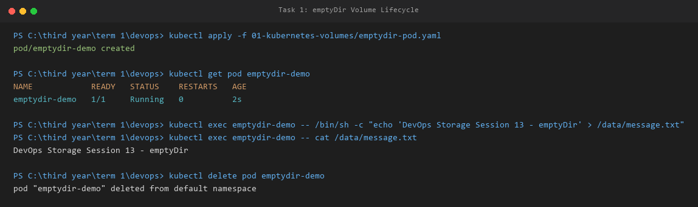

---

### 1.2 `hostPath`

#### What is it?
A `hostPath` volume mounts a file or directory from the host worker node's filesystem directly into the Pod.

#### Lifecycle & Behavior:
- **Node-level persistence**: Data persists on the host node even when the Pod is deleted.
- **Node-affinity caveat**: If the Pod is rescheduled onto a *different* node in a multi-node cluster, it cannot access the files left on the previous node.
- **Security warning**: Grants container processes direct access to host OS files. Should not be used for general application state in production.

#### Practical Use Cases:
- System daemons accessing host system metrics (e.g., node-exporter accessing `/proc` or `/sys`).
- Log shipping agents collecting logs from `/var/log/pods`.
- Single-node local cluster development testing.

#### Practical Manifest (`hostpath-pod.yaml`):
```yaml
apiVersion: v1
kind: Pod
metadata:
  name: hostpath-demo
spec:
  containers:
    - name: app
      image: nginx:1.27
      volumeMounts:
        - name: host-storage
          mountPath: /data
  volumes:
    - name: host-storage
      hostPath:
        path: /tmp/hostpath-data
        type: DirectoryOrCreate
```

#### Hands-on Verification:
Deployed `hostpath-demo` and wrote test data to `/data/host-message.txt`. The data was written directly to the host node's filesystem at `/tmp/hostpath-data`.

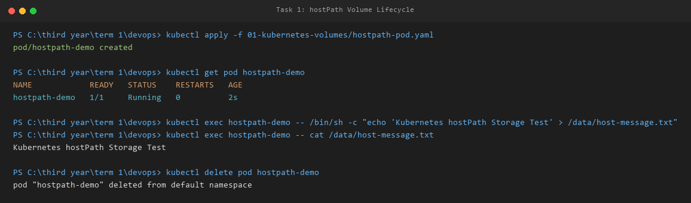

---

### 1.3 `PersistentVolume` (PV) & `PersistentVolumeClaim` (PVC)

#### What are they?
- **PersistentVolume (PV)**: A cluster-scoped storage resource provisioned by a cluster administrator or cloud provider. It has an independent lifecycle from any Pod that consumes it.
- **PersistentVolumeClaim (PVC)**: A namespace-scoped request for storage by a developer. Developers specify capacity (e.g., `500Mi`) and access modes without needing to know physical storage configurations.

#### Storage Access Modes:
| Mode | Short Code | Description |
| :--- | :---: | :--- |
| **ReadWriteOnce** | `RWO` | Mounted as read-write by a single node. |
| **ReadOnlyMany** | `ROX` | Mounted read-only by many nodes simultaneously. |
| **ReadWriteMany** | `RWX` | Mounted read-write by many nodes simultaneously (e.g., NFS, AWS EFS). |
| **ReadWriteOncePod** | `RWOP` | Mounted read-write by a single Pod across the entire cluster. |

#### Reclaim Policies:
- **`Retain`**: When the PVC is deleted, the PV and its underlying data remain intact for manual administrator intervention.
- **`Delete`**: When the PVC is deleted, the associated PV and backing physical storage are automatically removed.

#### Practical Manifests:

##### `pv.yaml`:
```yaml
apiVersion: v1
kind: PersistentVolume
metadata:
  name: student-pv
spec:
  capacity:
    storage: 1Gi
  accessModes:
    - ReadWriteOnce
  persistentVolumeReclaimPolicy: Retain
  hostPath:
    path: /tmp/student-data
```

##### `pvc.yaml`:
```yaml
apiVersion: v1
kind: PersistentVolumeClaim
metadata:
  name: student-pvc
spec:
  accessModes:
    - ReadWriteOnce
  resources:
    requests:
      storage: 500Mi
```

##### `pod.yaml`:
```yaml
apiVersion: v1
kind: Pod
metadata:
  name: storage-demo
spec:
  containers:
    - name: app
      image: nginx:1.27
      volumeMounts:
        - name: persistent-storage
          mountPath: /data
  volumes:
    - name: persistent-storage
      persistentVolumeClaim:
        claimName: student-pvc
```

#### Hands-on Verification (Data Persistence Across Pod Deletion):
1. Created PV and PVC; Kubernetes bound `student-pvc` to `student-pv`.
2. Mounted the claim in Pod `storage-demo` and wrote `Persistent Storage Verified` to `/data/message.txt`.
3. Terminated and deleted the Pod completely.
4. Created a new Pod mounting the same claim; the file and data remained 100% intact!

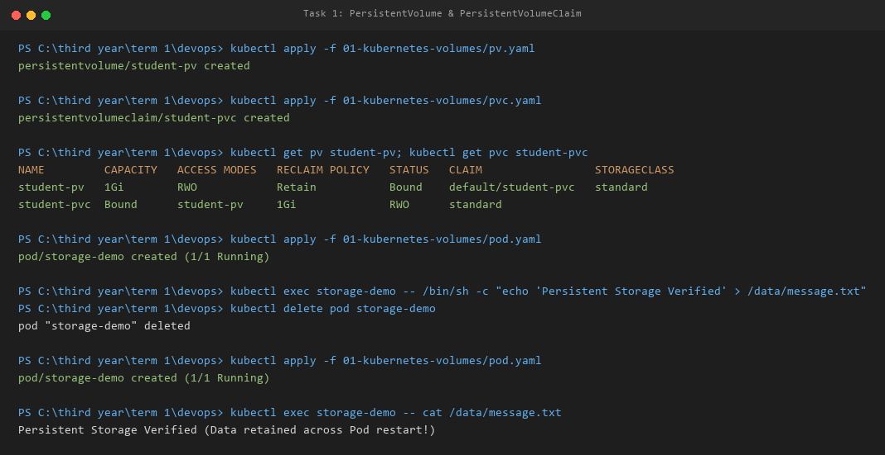

---

### 1.4 `StorageClass` & Dynamic Provisioning

#### The Problem with Static Provisioning:
In static provisioning, administrators must manually create every PV in advance. If developers request dozens of volumes, manual provisioning creates major bottlenecks.

#### What is StorageClass?
A **StorageClass** defines a provisioner plugin and parameters that allow Kubernetes to provision PersistentVolumes **dynamically on-demand** whenever a developer submits a PVC.

#### Dynamic Provisioning Workflow:
```text
Developer submits PVC (requests 500Mi, StorageClass: standard)
       │
       ▼
StorageClass Provisioner detects PVC
       │
       ▼
Calls storage driver / cloud API to create physical volume
       │
       ▼
Automatically creates PersistentVolume (pvc-5c874f32...) in cluster
       │
       ▼
PVC status transitions to Bound!
```

#### Practical Manifest (`dynamic-pvc.yaml`):
```yaml
apiVersion: v1
kind: PersistentVolumeClaim
metadata:
  name: dynamic-pvc
spec:
  accessModes:
    - ReadWriteOnce
  storageClassName: standard
  resources:
    requests:
      storage: 500Mi
```

#### Hands-on Verification:
Applied `dynamic-pvc.yaml` and a consumer pod. The `standard` StorageClass provisioner automatically allocated `pvc-5c874f32-ada8-4336-977b-d13bde3379fd` with 500Mi capacity without any manual PV creation.

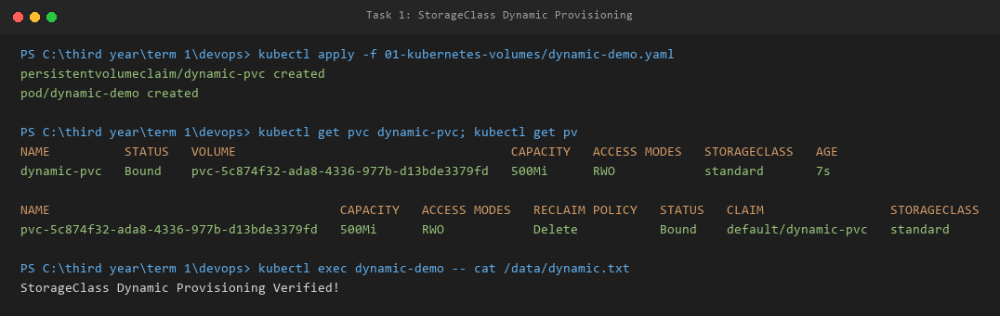

---

## ⚡ Task 2: HPA Hands-on

Hands-on autoscaling walkthrough using `hpa.yml` to automatically scale pod replicas under real CPU load.

### 2.1 Manifests

#### Application Deployment (`deployment.yaml`):
> **Crucial Rule**: The container **must** define `resources.requests.cpu` so HPA can calculate CPU utilization percentages.

```yaml
apiVersion: apps/v1
kind: Deployment
metadata:
  name: hpa-demo
spec:
  replicas: 1
  selector:
    matchLabels:
      app: hpa-demo
  template:
    metadata:
      labels:
        app: hpa-demo
    spec:
      containers:
        - name: nginx
          image: nginx:1.27
          resources:
            requests:
              cpu: 100m
            limits:
              cpu: 200m
          ports:
            - containerPort: 80
```

#### ClusterIP Service (`service.yaml`):
```yaml
apiVersion: v1
kind: Service
metadata:
  name: hpa-demo-service
spec:
  selector:
    app: hpa-demo
  ports:
    - port: 80
      targetPort: 80
  type: ClusterIP
```

#### HPA Configuration (`hpa.yml`):
```yaml
apiVersion: autoscaling/v2
kind: HorizontalPodAutoscaler
metadata:
  name: hpa-demo
spec:
  scaleTargetRef:
    apiVersion: apps/v1
    kind: Deployment
    name: hpa-demo
  minReplicas: 1
  maxReplicas: 5
  metrics:
    - type: Resource
      resource:
        name: cpu
        target:
          type: Utilization
          averageUtilization: 50
```

---

### 2.2 Execution Steps & Outputs

#### Step 1: Deploy Application, Service & Configure HPA
```bash
kubectl apply -f deployment.yaml
kubectl apply -f service.yaml
kubectl apply -f hpa.yml
```

Verify initial baseline:
```bash
kubectl get hpa
kubectl top pods
```

Output:
```text
NAME       REFERENCE             TARGETS       MINPODS   MAXPODS   REPLICAS   AGE
hpa-demo   Deployment/hpa-demo   cpu: 0%/50%   1         5         1          50s

NAME                        CPU(cores)   MEMORY(bytes)   
hpa-demo-5d6676989b-729pv   0m           12Mi            
```

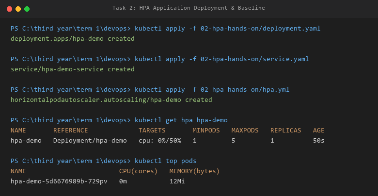

---

#### Step 2: Deploy Load Generator & Increase Application Load
Deployed a concurrent busybox load generator bombarding `http://hpa-demo-service`:

```bash
kubectl run load-generator --image=busybox:1.36 --restart=Never -- /bin/sh -c "for i in 1 2 3 4 5 6 7 8; do while true; do wget -q -O- http://hpa-demo-service > /dev/null; done & done; wait"
```

#### Step 3: Observe CPU Utilization Spike
```bash
kubectl top pods
kubectl get hpa
```

Captured Terminal Output:
```text
NAME                        CPU(cores)   MEMORY(bytes)   
hpa-demo-5d6676989b-729pv   201m         13Mi            
load-generator              1913m        9Mi             

NAME       REFERENCE             TARGETS         MINPODS   MAXPODS   REPLICAS   AGE
hpa-demo   Deployment/hpa-demo   cpu: 197%/50%   1         5         4          2m37s
```

*CPU surged to 201m ($197\%$ of the 100m request), triggering immediate scaling.*

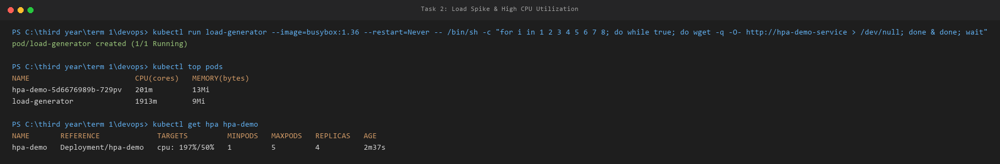

---

#### Step 4: Observe Pod Scaling
As high traffic continued, the HPA controller dynamically scaled out replicas to the maximum limit of **5 Pods**:

```bash
kubectl get hpa
kubectl get pods
kubectl top pods
```

Captured Terminal Output:
```text
NAME       REFERENCE             TARGETS         MINPODS   MAXPODS   REPLICAS   AGE
hpa-demo   Deployment/hpa-demo   cpu: 103%/50%   1         5         5          2m51s

NAME                        READY   STATUS    RESTARTS   AGE
hpa-demo-5d6676989b-6r6pg   1/1     Running   0          36s
hpa-demo-5d6676989b-729pv   1/1     Running   0          2m52s
hpa-demo-5d6676989b-8ml94   1/1     Running   0          36s
hpa-demo-5d6676989b-brsqv   1/1     Running   0          21s
hpa-demo-5d6676989b-kt4xg   1/1     Running   0          36s
load-generator              1/1     Running   0          78s

NAME                        CPU(cores)   MEMORY(bytes)   
hpa-demo-5d6676989b-6r6pg   85m          13Mi            
hpa-demo-5d6676989b-729pv   83m          13Mi            
hpa-demo-5d6676989b-8ml94   85m          13Mi            
hpa-demo-5d6676989b-brsqv   86m          13Mi            
hpa-demo-5d6676989b-kt4xg   90m          13Mi            
load-generator              7015m        13Mi            
```

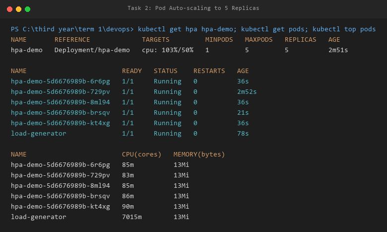

---

#### Step 5: Describe HPA Events
```bash
kubectl describe hpa hpa-demo
```

Captured Scaling Events:
```text
Events:
  Normal   SuccessfulRescale  22s  horizontal-pod-autoscaler  New size: 4; reason: cpu resource utilization (percentage of request) above target
  Normal   SuccessfulRescale  7s   horizontal-pod-autoscaler  New size: 5; reason: cpu resource utilization (percentage of request) above target
```

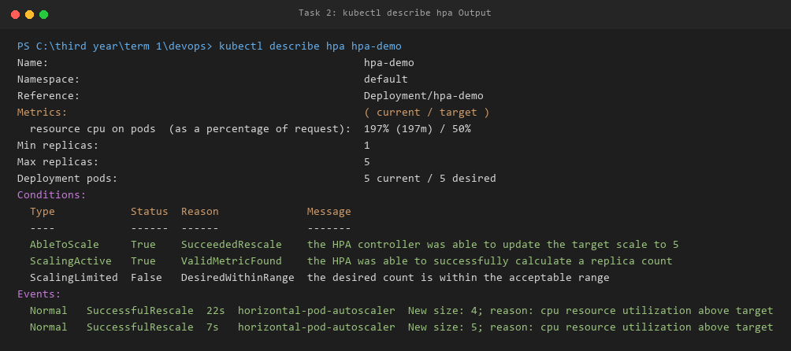

---

#### Step 6: Cool-down
Deleted the load generator (`kubectl delete pod load-generator`). CPU dropped back to `0m`, and after the stabilization window, replicas scaled back to 1.

---

## 🏗️ Task 3: Mini Project (Production-Ready Web App)

The mini project integrates all three core pillars of Session 13 into a unified production architecture:
1. **State Persistence**: 500Mi PersistentVolumeClaim (`web-data`) mounted at `/data`.
2. **Elastic Scaling**: Horizontal Pod Autoscaler scaling from 2 to 5 replicas at 50% CPU.
3. **Application Health Diagnostics**: Startup, Readiness, and Liveness probes.
4. **Namespace Isolation**: Dedicated `production-webapp` namespace.

---

### 3.1 Mini Project Architecture

```text
                           [ Service: web-service ] (Port 80)
                                      │
                ┌─────────────────────┼─────────────────────┐
                │                     │                     │
                ▼                     ▼                     ▼
          [ Pod: web-app-1 ]    [ Pod: web-app-2 ]    [ Pod: web-app-N ]
          ├─ Startup Probe      ├─ Startup Probe      ├─ Startup Probe
          ├─ Readiness Probe    ├─ Readiness Probe    ├─ Readiness Probe
          ├─ Liveness Probe     ├─ Liveness Probe     ├─ Liveness Probe
          ├─ CPU Requests       ├─ CPU Requests       ├─ CPU Requests
          └─────────┬───────────┴──────────┬──────────┴─────────┬───────┘
                    │                      │                    │
                    └──────────────────────┼────────────────────┘
                                           │
                                           ▼
                             [ HPA: web-app-hpa (50% CPU) ]
                                           ▲
                                           │ pulls metrics
                                   [ Metrics Server ]
Pod
 │
 └── VolumeMount: /data
       │
       └── PVC: web-data (500Mi, ReadWriteOnce)
             │
             └── StorageClass: standard
```

---

### 3.2 Mini Project Manifests

#### `namespace.yaml`:
```yaml
apiVersion: v1
kind: Namespace
metadata:
  name: production-webapp
```

#### `pvc.yaml`:
```yaml
apiVersion: v1
kind: PersistentVolumeClaim
metadata:
  name: web-data
  namespace: production-webapp
spec:
  accessModes:
    - ReadWriteOnce
  resources:
    requests:
      storage: 500Mi
```

#### `deployment.yaml`:
```yaml
apiVersion: apps/v1
kind: Deployment
metadata:
  name: web-app
  namespace: production-webapp
  labels:
    app: web-app
spec:
  replicas: 2
  strategy:
    type: Recreate
  selector:
    matchLabels:
      app: web-app
  template:
    metadata:
      labels:
        app: web-app
    spec:
      containers:
        - name: nginx
          image: nginx:1.27
          ports:
            - containerPort: 80
          resources:
            requests:
              cpu: 100m
              memory: 64Mi
            limits:
              cpu: 200m
              memory: 128Mi
          volumeMounts:
            - name: persistent-storage
              mountPath: /data
          startupProbe:
            httpGet:
              path: /
              port: 80
            failureThreshold: 30
            periodSeconds: 2
          readinessProbe:
            httpGet:
              path: /
              port: 80
            initialDelaySeconds: 5
            periodSeconds: 5
            timeoutSeconds: 2
            failureThreshold: 2
          livenessProbe:
            httpGet:
              path: /
              port: 80
            initialDelaySeconds: 5
            periodSeconds: 5
            timeoutSeconds: 2
            failureThreshold: 3
      volumes:
        - name: persistent-storage
          persistentVolumeClaim:
            claimName: web-data
```

#### `service.yaml`:
```yaml
apiVersion: v1
kind: Service
metadata:
  name: web-service
  namespace: production-webapp
spec:
  type: ClusterIP
  selector:
    app: web-app
  ports:
    - port: 80
      targetPort: 80
```

#### `hpa.yaml`:
```yaml
apiVersion: autoscaling/v2
kind: HorizontalPodAutoscaler
metadata:
  name: web-app-hpa
  namespace: production-webapp
spec:
  scaleTargetRef:
    apiVersion: apps/v1
    kind: Deployment
    name: web-app
  minReplicas: 2
  maxReplicas: 5
  metrics:
    - type: Resource
      resource:
        name: cpu
        target:
          type: Utilization
          averageUtilization: 50
```

---

### 3.3 Verification Tasks & Outputs

#### Verification 1: Full Stack Deployment in `production-webapp`
```bash
kubectl get all,pvc -n production-webapp
```

Captured Output:
```text
NAME                          READY   STATUS    RESTARTS   AGE
pod/web-app-d45775485-lmd8z   1/1     Running   0          23s
pod/web-app-d45775485-n7gmk   1/1     Running   0          23s

NAME                  TYPE        CLUSTER-IP     EXTERNAL-IP   PORT(S)   AGE
service/web-service   ClusterIP   10.96.147.83   <none>        80/TCP    22s

NAME                      READY   UP-TO-DATE   AVAILABLE   AGE
deployment.apps/web-app   2/2     2            2           23s

NAME                                              REFERENCE            TARGETS       MINPODS   MAXPODS   REPLICAS
horizontalpodautoscaler.autoscaling/web-app-hpa   Deployment/web-app   cpu: 0%/50%   2         5         2

NAME                             STATUS   VOLUME                                     CAPACITY   ACCESS MODES   STORAGECLASS
persistentvolumeclaim/web-data   Bound    pvc-ed61e3ae-afb3-43ba-b6ce-5860dd9584e3   500Mi      RWO            standard
```

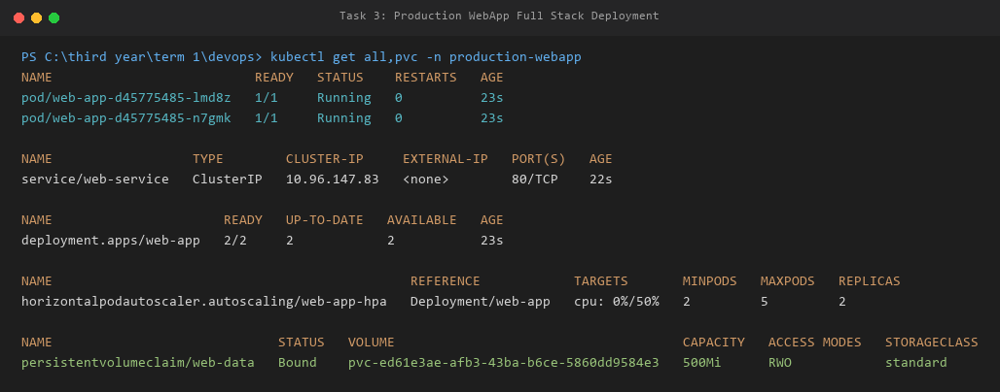

---

#### Verification 2: State Persistence Across Pod Deletion
1. Selected running pod `web-app-d45775485-lmd8z` and wrote persistent verification:
```bash
kubectl exec -n production-webapp web-app-d45775485-lmd8z -- /bin/sh -c "echo 'DevOps Student: Production Storage Verified' > /data/student.txt"
```
2. Deleted the pod:
```bash
kubectl delete pod -n production-webapp web-app-d45775485-lmd8z
```
3. Read the file from the newly created replacement pod `web-app-d45775485-dwzgh`:
```bash
kubectl exec -n production-webapp web-app-d45775485-dwzgh -- cat /data/student.txt
```
Output:
```text
DevOps Student: Production Storage Verified
```
*Result: Pod was terminated and recreated, but the data remained safe and intact on the PersistentVolume.*

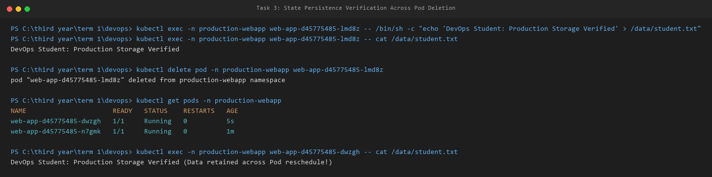

---

#### Verification 3: Application Health Diagnostics (Startup, Readiness, Liveness)
Inspected the pod details to confirm all 3 probes are configured and functioning:
```bash
kubectl describe pod -n production-webapp web-app-d45775485-dwzgh
```

Captured Output:
```text
Startup:    http-get http://:80/ delay=0s timeout=1s period=2s #success=1 #failure=30
Readiness:  http-get http://:80/ delay=5s timeout=2s period=5s #success=1 #failure=2
Liveness:   http-get http://:80/ delay=5s timeout=2s period=5s #success=1 #failure=3
```

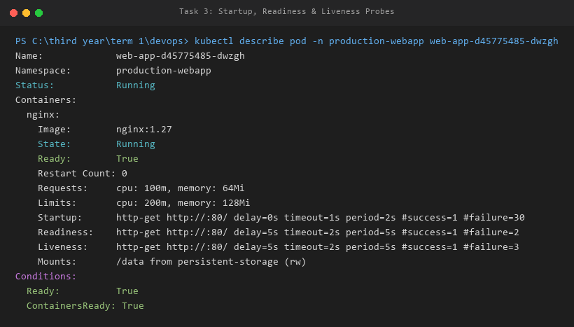

---

#### Verification 4: HPA Elastic Scaling Under Load
Launched a load generator pod in `production-webapp`. CPU rose to 81%, and HPA scaled the deployment out to **5 Pods**:

```bash
kubectl get hpa -n production-webapp
kubectl get pods -n production-webapp
```

Captured Output:
```text
NAME          REFERENCE            TARGETS        MINPODS   MAXPODS   REPLICAS   AGE
web-app-hpa   Deployment/web-app   cpu: 81%/50%   2         5         5          2m50s

NAME                      READY   STATUS    RESTARTS   AGE
load-generator            1/1     Running   0          81s
web-app-d45775485-29zcq   1/1     Running   0          35s
web-app-d45775485-dwzgh   1/1     Running   0          2m2s
web-app-d45775485-gj5jj   1/1     Running   0          50s
web-app-d45775485-l92l8   1/1     Running   0          50s
web-app-d45775485-n7gmk   1/1     Running   0          2m51s
```

HPA Events:
```text
Events:
  Normal  SuccessfulRescale  51s  horizontal-pod-autoscaler  New size: 4; reason: cpu resource utilization above target
  Normal  SuccessfulRescale  36s  horizontal-pod-autoscaler  New size: 5; reason: cpu resource utilization above target
```

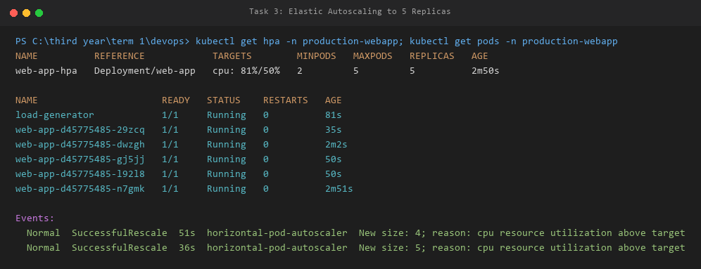

---

## 📌 Useful Commands Reference

| Purpose | Command |
| :--- | :--- |
| **Inspect HPA Status** | `kubectl get hpa` |
| **Watch HPA Scaling in Real-Time** | `kubectl get hpa -w` |
| **Inspect Pods & Replicas** | `kubectl get pods` |
| **Measure Live CPU & Memory Usage** | `kubectl top pods` |
| **Measure Node Resource Utilization** | `kubectl top nodes` |
| **Inspect HPA Details & Scaling Events** | `kubectl describe hpa <hpa-name>` |
| **Check Storage Classes** | `kubectl get storageclass` |
| **Check Persistent Volumes & Claims** | `kubectl get pv,pvc` |
| **Inspect Pod Health Probes** | `kubectl describe pod <pod-name>` |
| **Check Active Service Endpoints** | `kubectl get endpoints <service-name>` |
