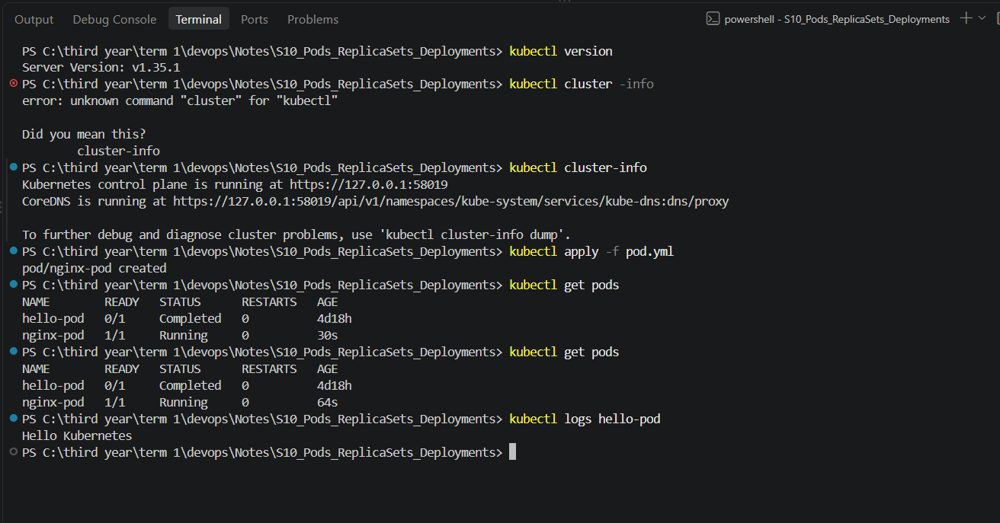
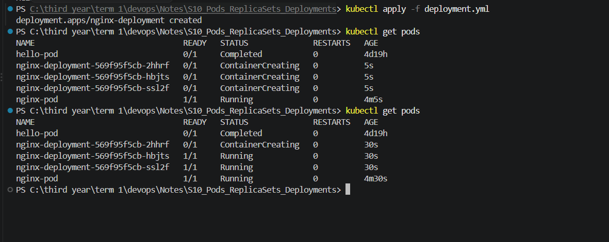
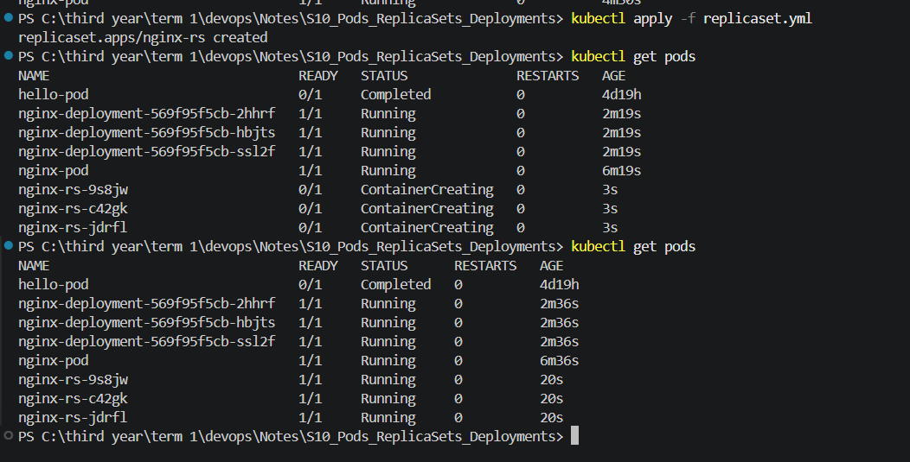
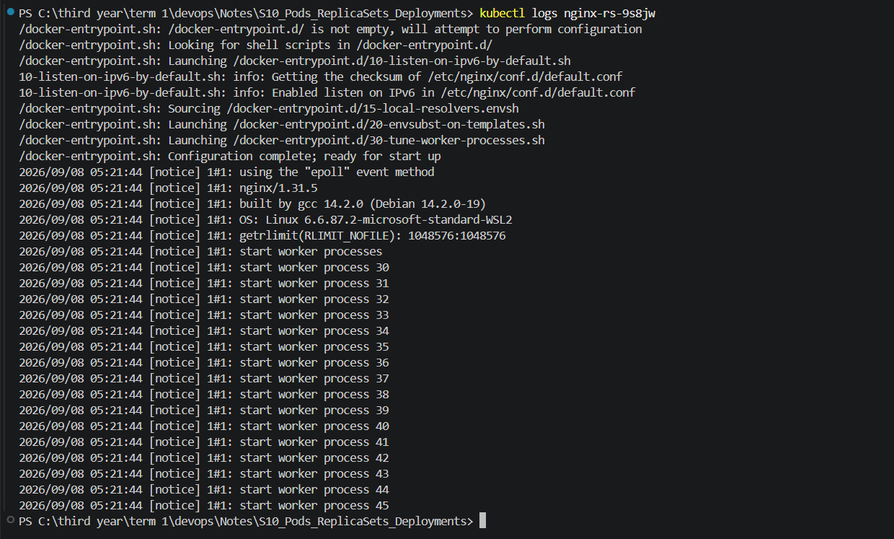
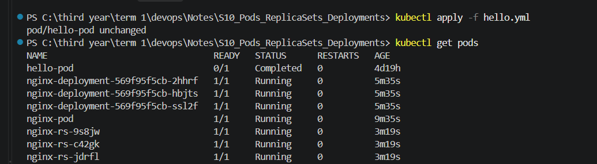
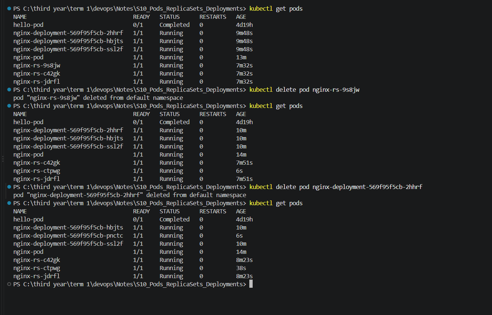
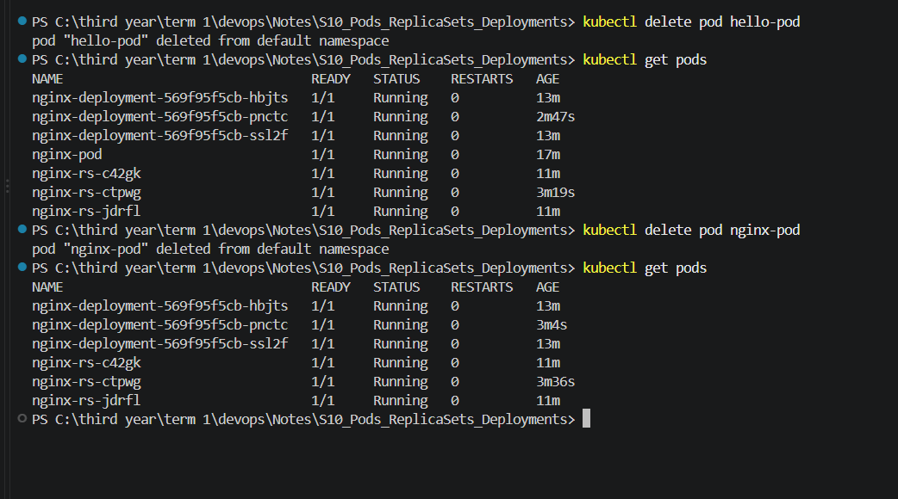
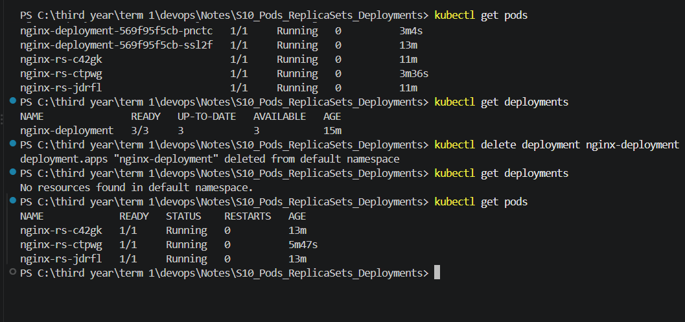
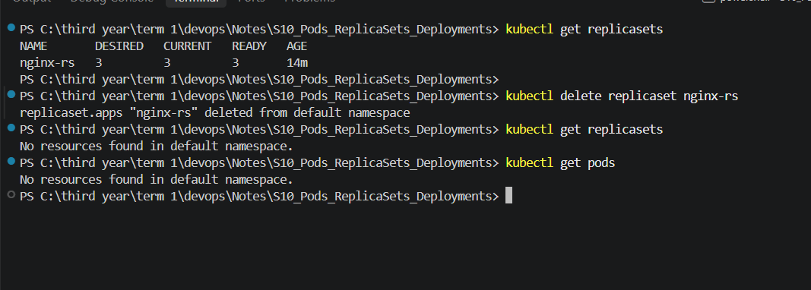

## pod.yml :

## deployment.yml :

## replicaset.yml :

## replicaset.yml logs :

# Tried running hello.yml again :

`The hello-pod already exists, and your YAML hasn't changed anything.`

## Tried deleting one pod from both Deployment and Replicaset :

# they again created one-- 

## Deleted nginx and hello-pod :

## Deleted Deployments :

## Deleted Replicasets:

# Check Kubernetes Controllers

kubectl get deployments
# Issue: Shows Deployments that manage Pods and can recreate them if deleted.

kubectl get replicasets
# Issue: Shows ReplicaSets that maintain the desired number of Pods and recreate deleted Pods.

# Delete the Deployment

kubectl delete deployment nginx-deployment
# Issue: Deletes the nginx Deployment and stops it from managing/recreating its Pods.
