## Helm initail commands and installing nginx :

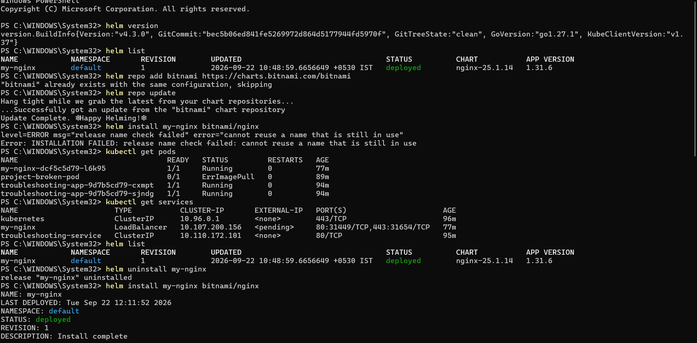
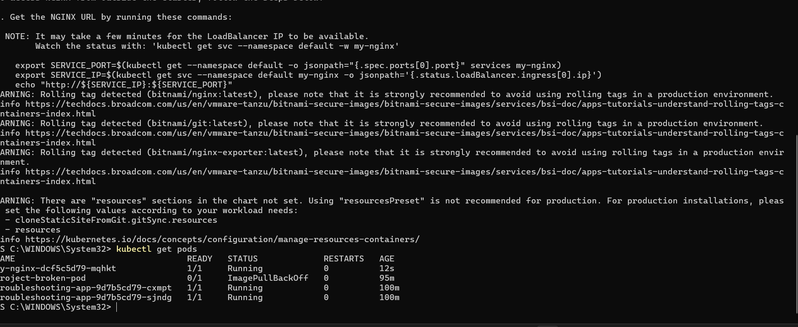

## helm serach :
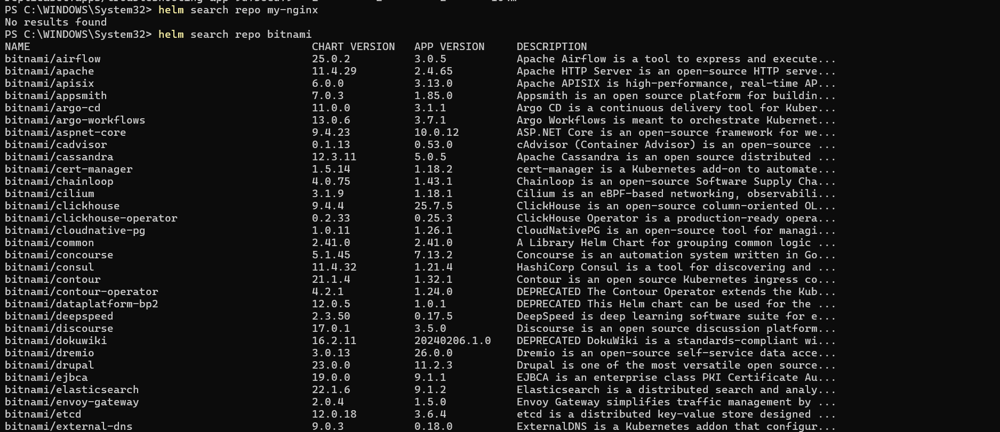

## DEMO-CHART:
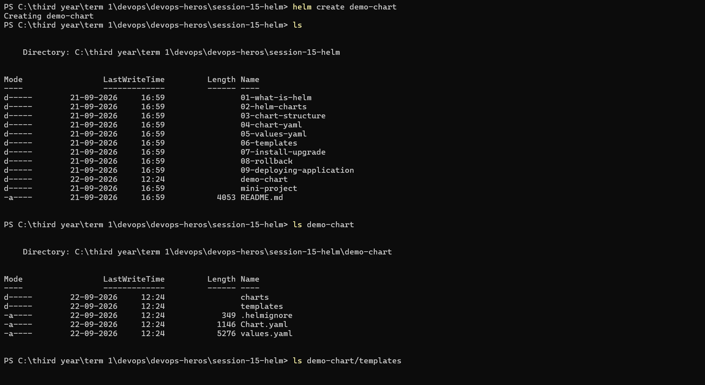
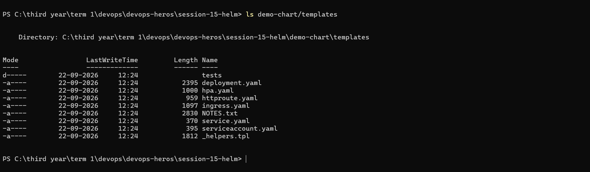

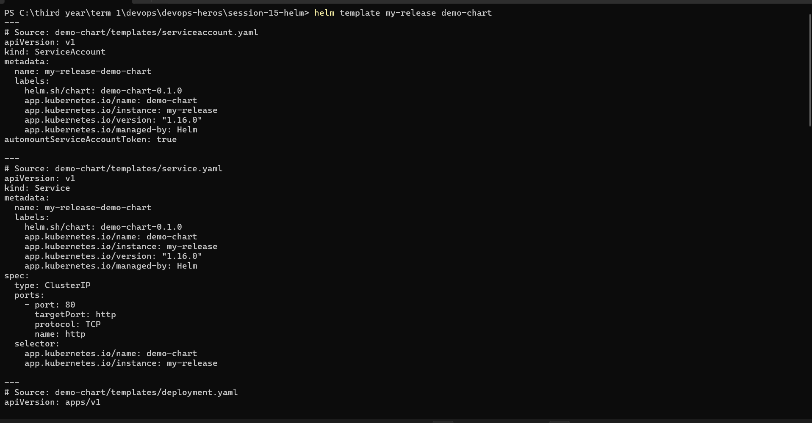
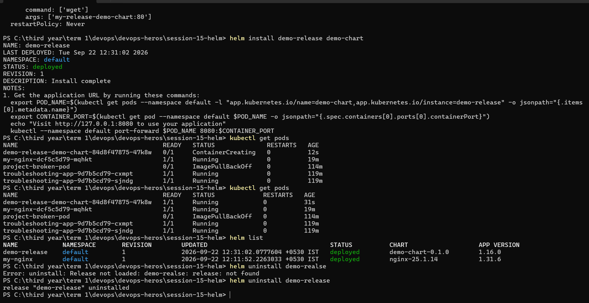

## simple-chart:

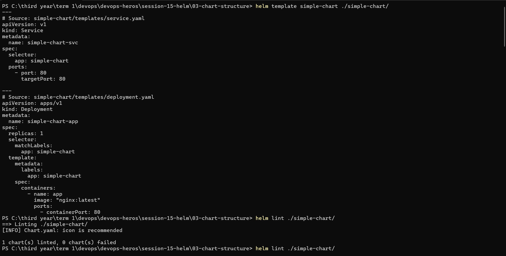
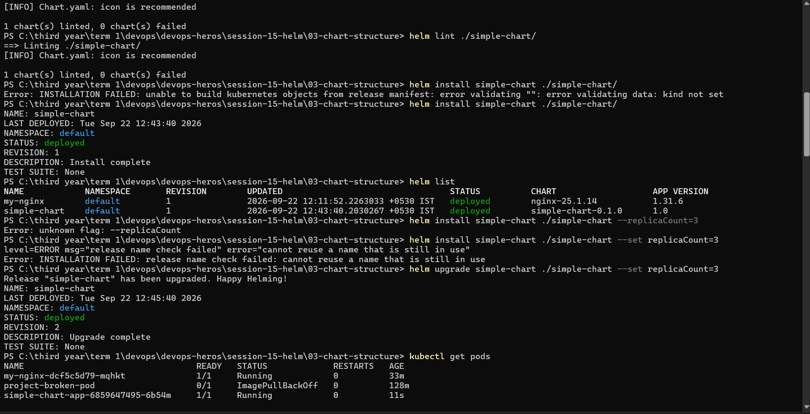

## rollback, status , history :

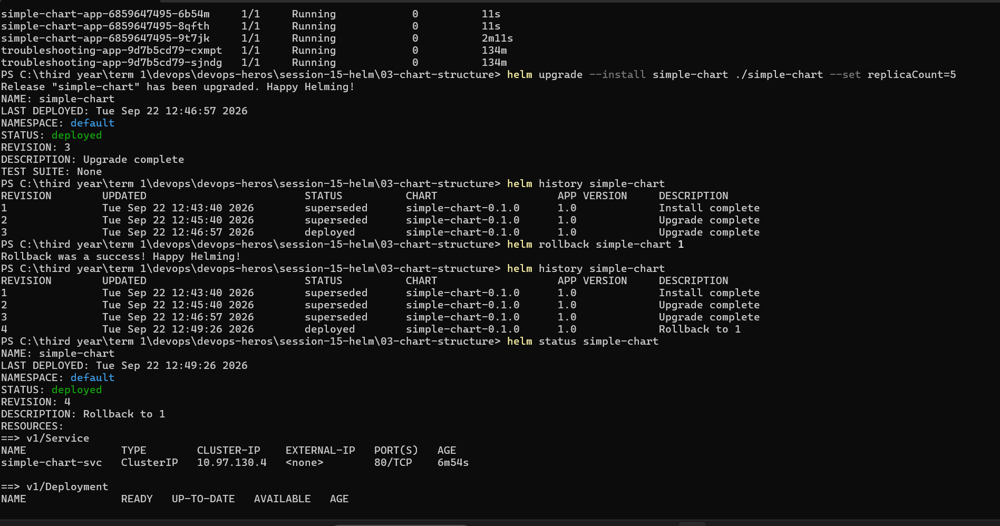
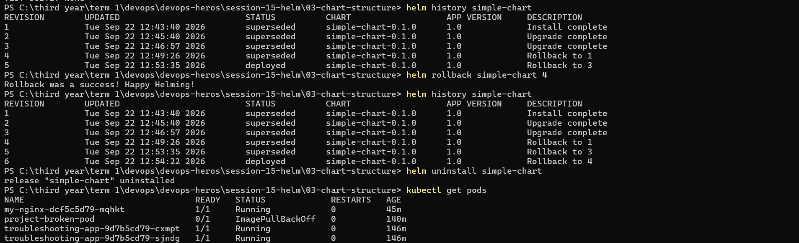

## 05-values.yaml :
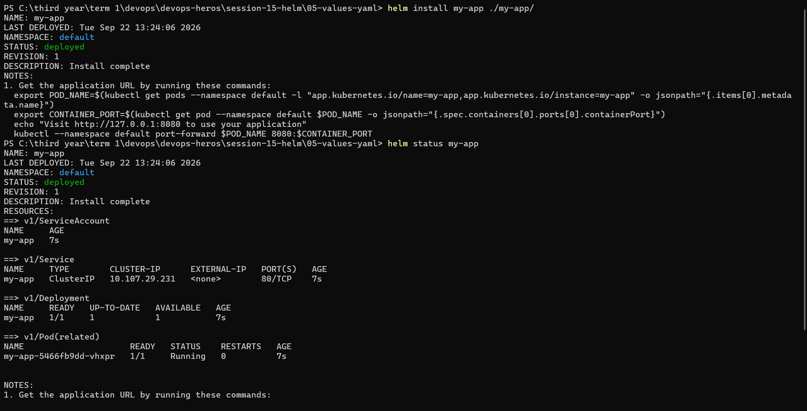
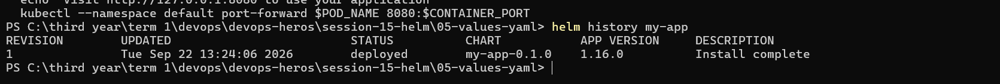
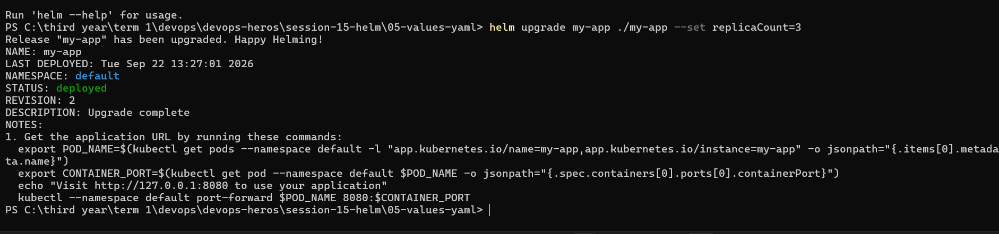
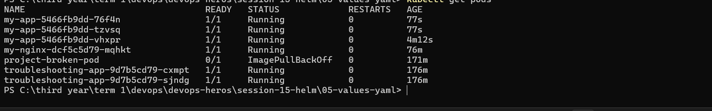

## -f
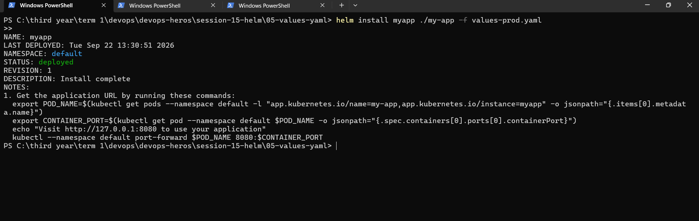

## mini-project:
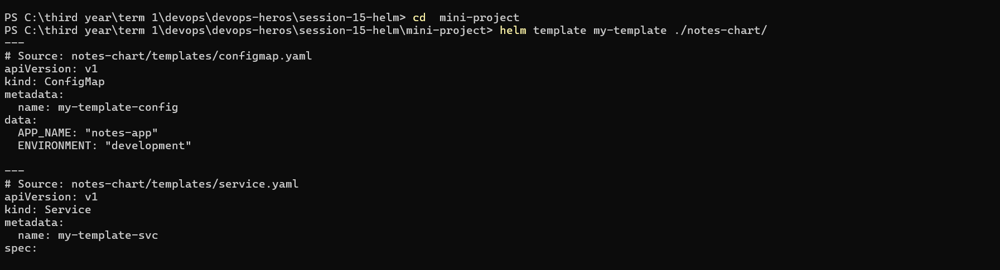
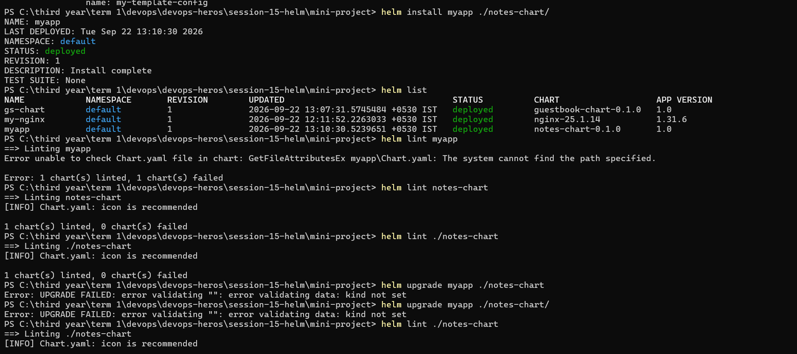
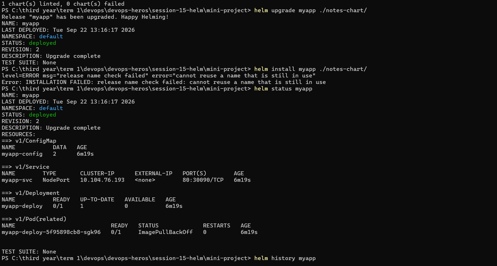
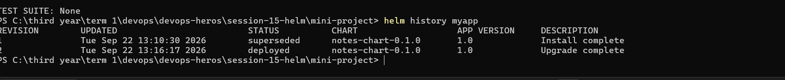

### rollback : 
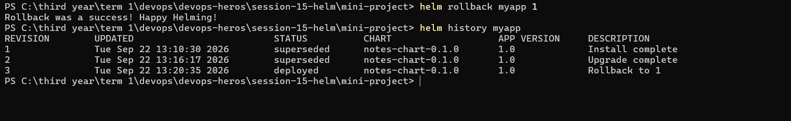