# CLUSTER_IP: 

## Deploy the Backend Web Application

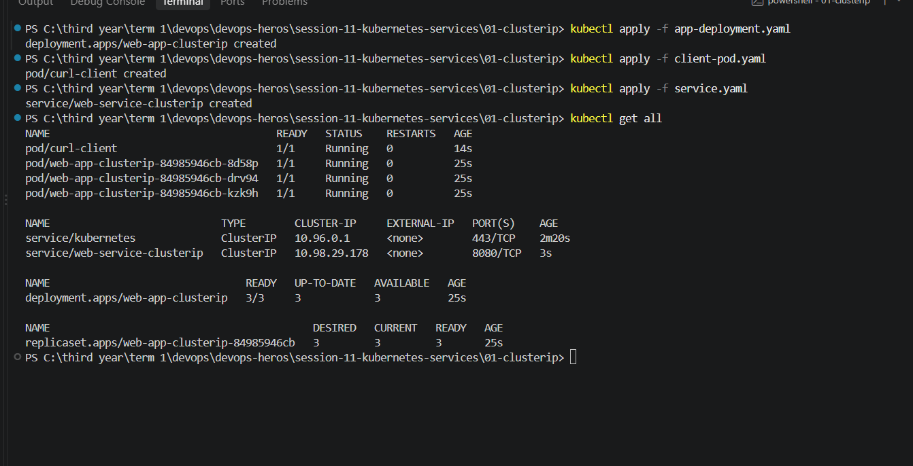

## get svc : 
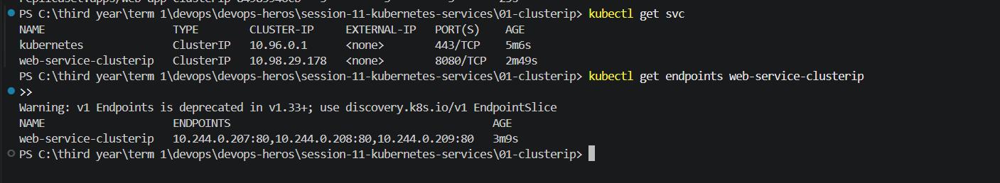

## Check Website Traffic on ClusterIP: 

### Internal Test Pod (Production-Style Verification)
Query by Service Name (CoreDNS resolution):
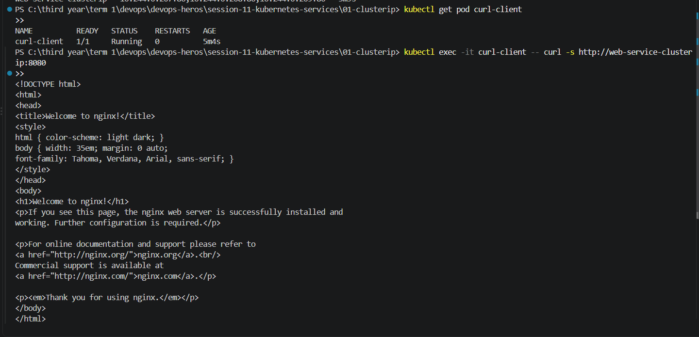

Query by Fully Qualified Domain Name (FQDN):
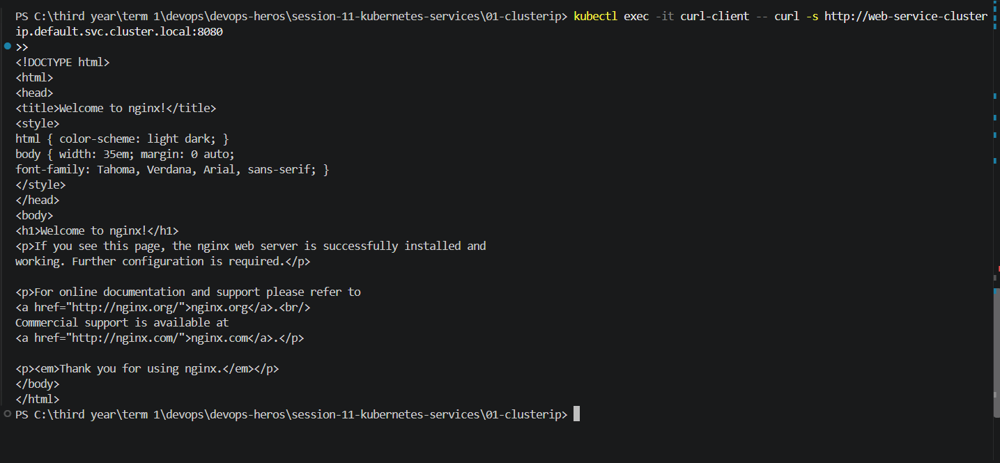

## Port-Forward to Local Browser (Developer Debugging) :
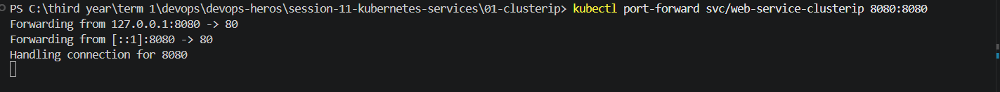
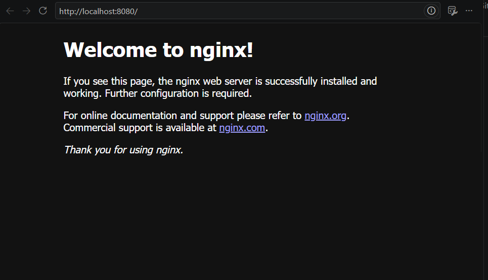

## get svc :
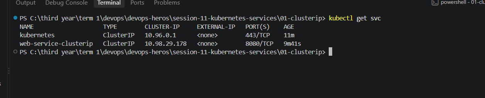

## CleanUp: 

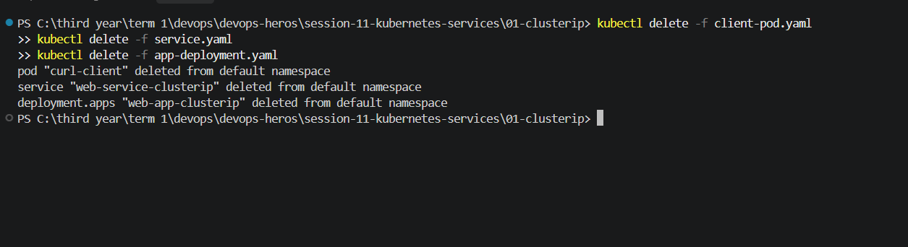

# NODEPORT :

## Run and Deploy:
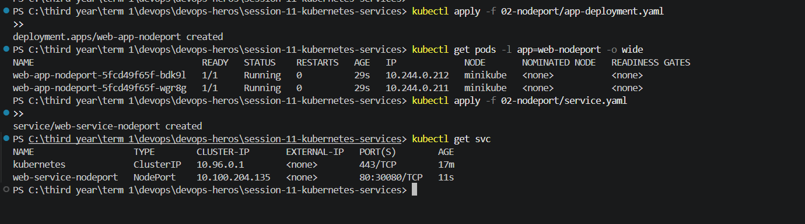

## Check Website Traffic on NodePort:
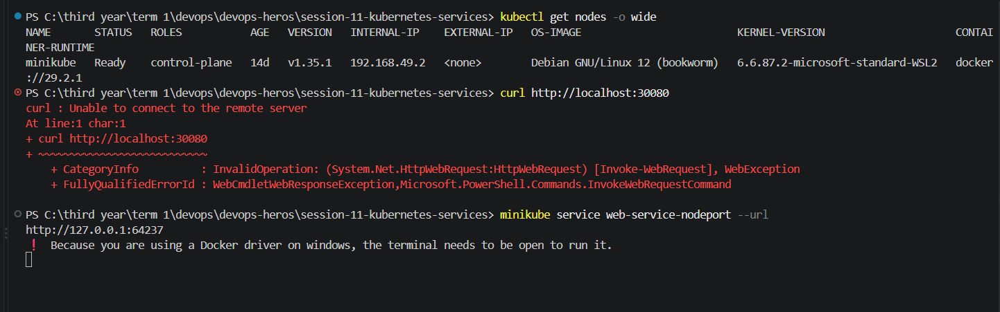
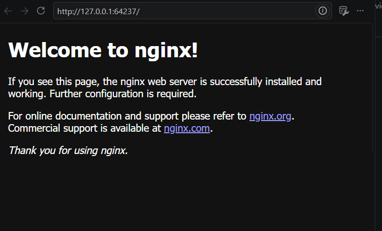

## cleanup :
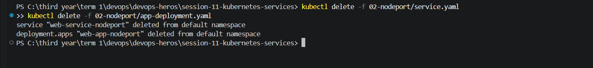

# LoadBalancer :

## Run and Deploy:
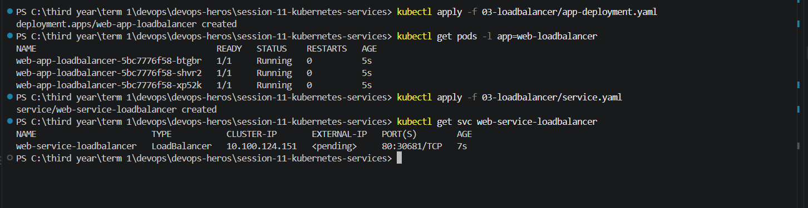

## Check Website Traffic on LoadBalancer:
### In Local Development (Minikube / Docker Desktop):

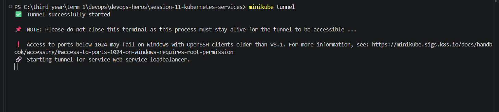
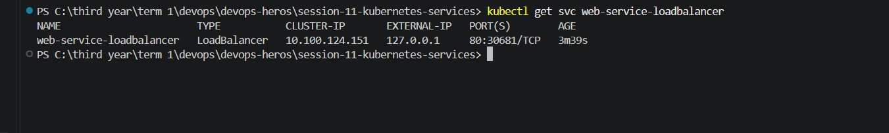
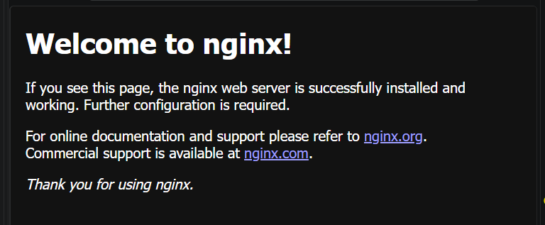

###  Direct Minikube Service Access :
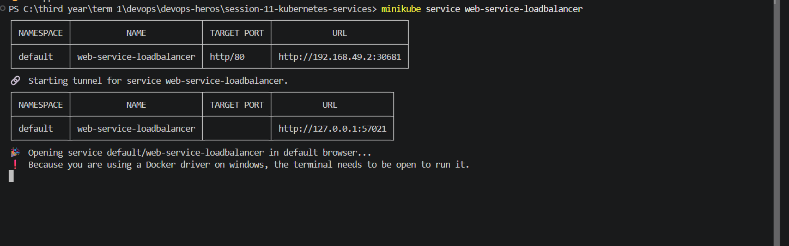

## Cleanup:
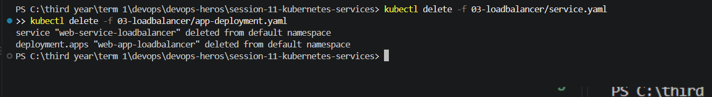

# ExternalName :

## Run and Deploy :
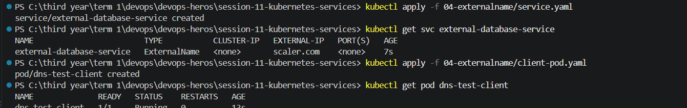

##  Verify DNS CNAME Resolution:

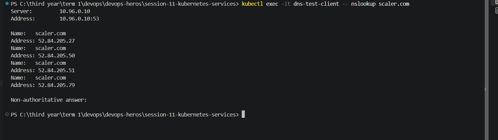

## Cleanup :
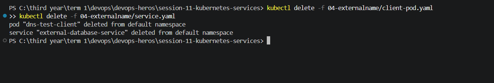

# Headless Service :

## Run and Deploy
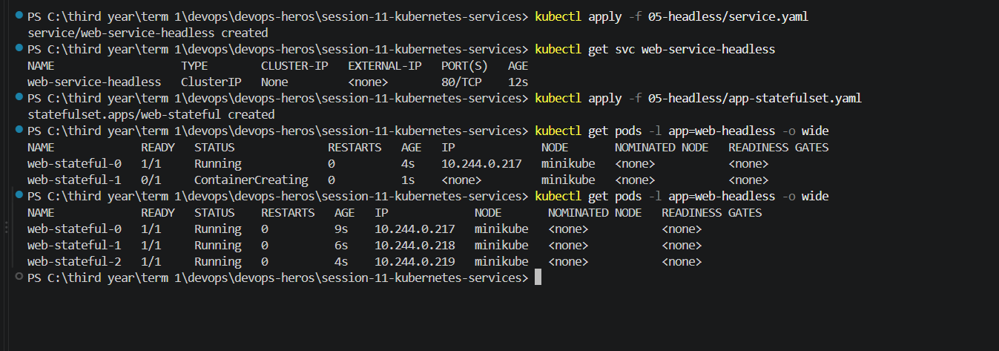

## Check DNS & Traffic on Headless Service:

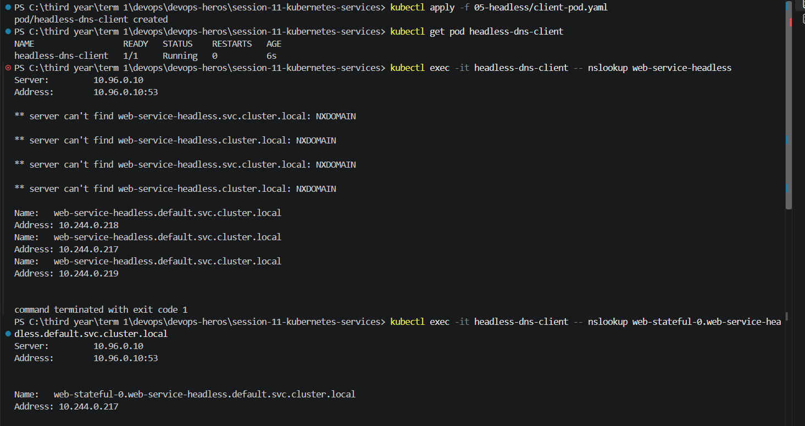
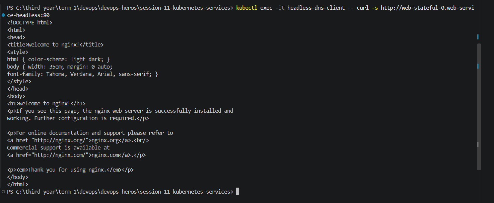

## Cleanup:
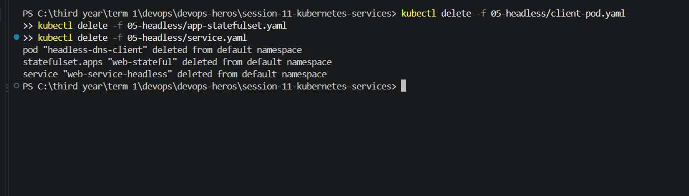

