## aws configure
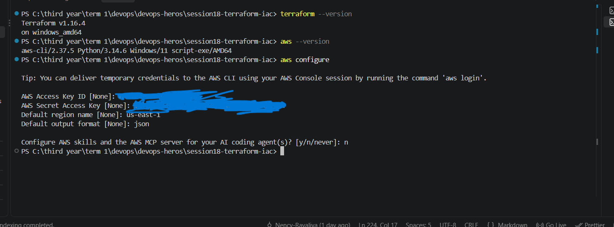

## terraform init:
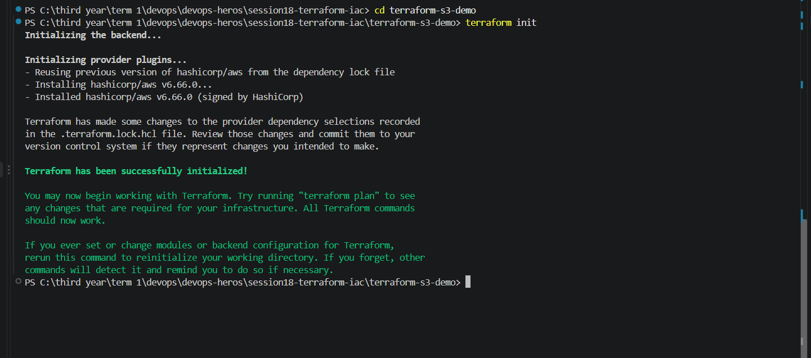

`ls -a`---> `ls -Force`

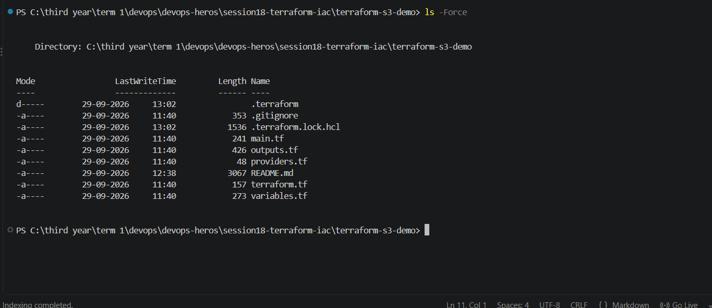

## formated 
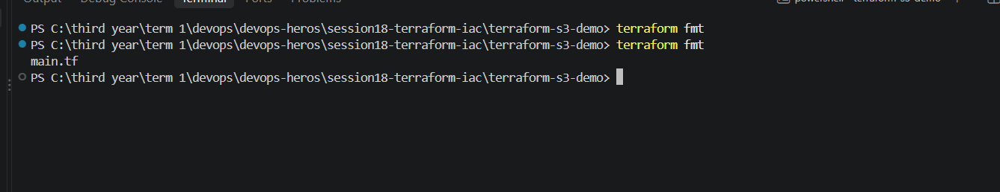

## put an error
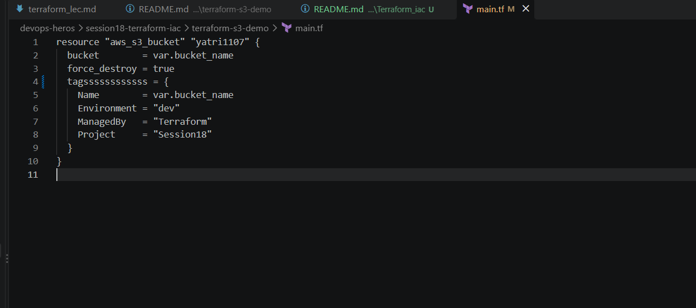

## validate
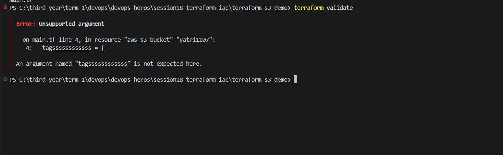

## after fix , validate:

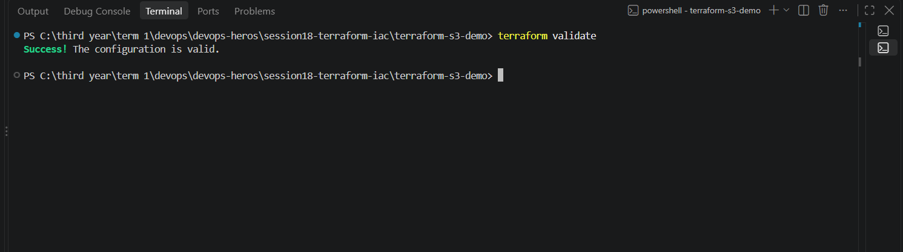

## terraform plan:

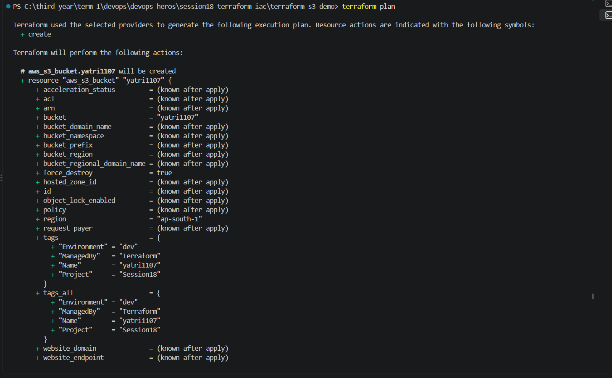
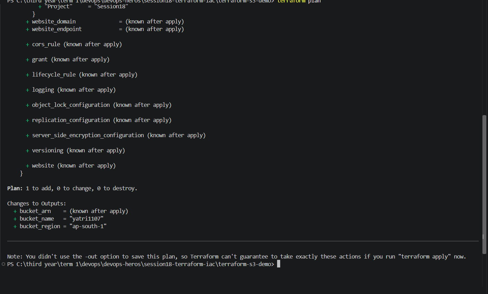

## terraform apply :
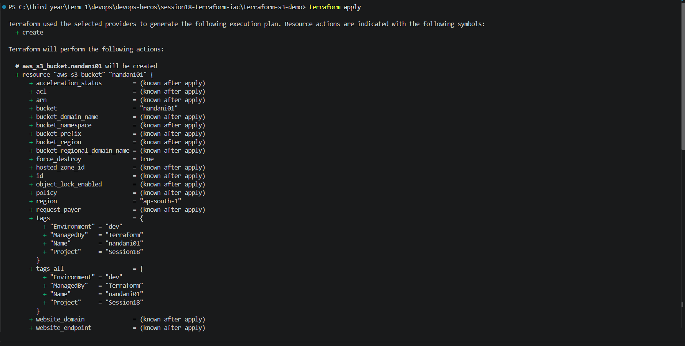
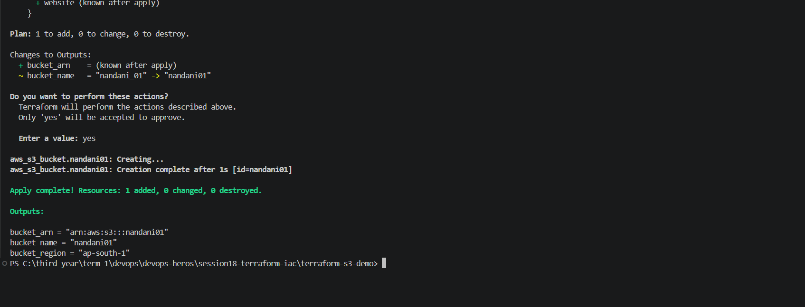

## terraform output :
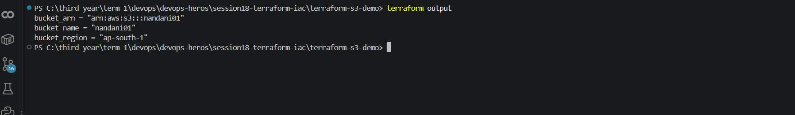

## terraform state list :
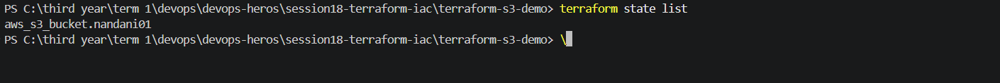

## terraform state show aws_s3_bucket.nandani01

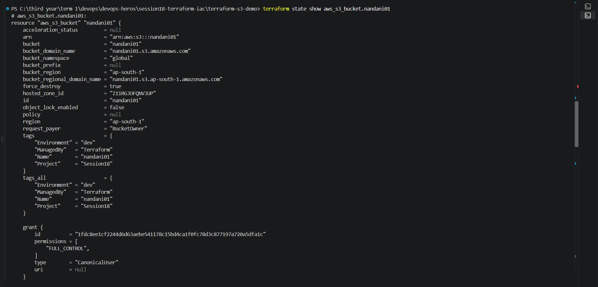

## terraform plan -destory :
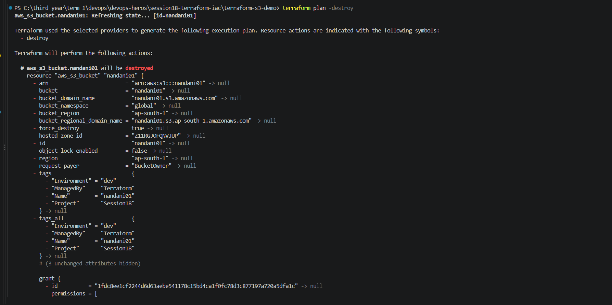

## terraform destroy:
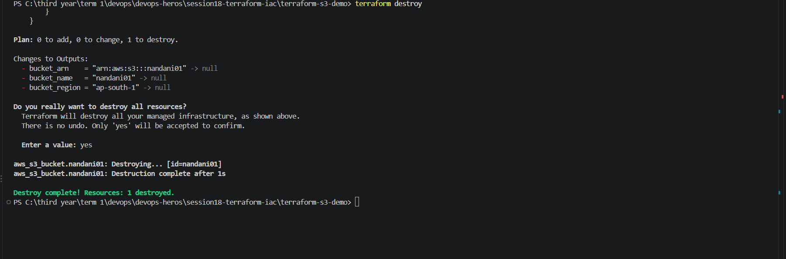