## compose up :
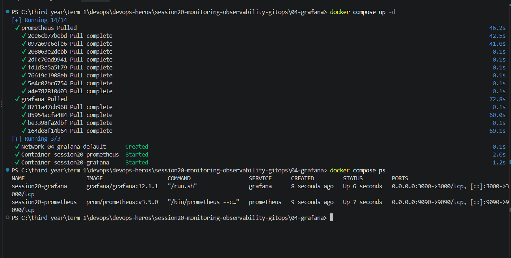

## Prometheus dashbooard:
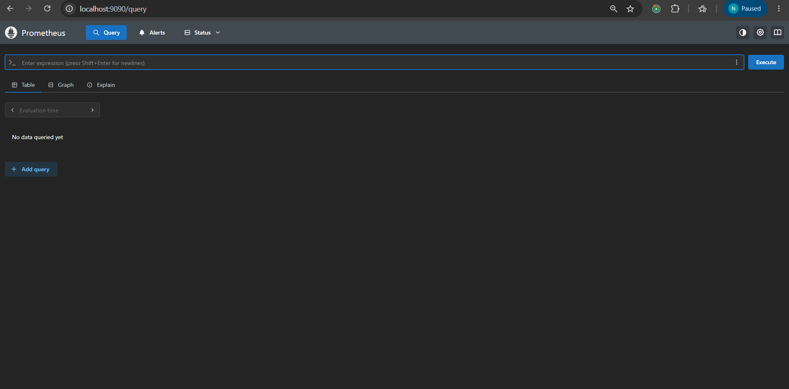

## Grafana Dashboard:
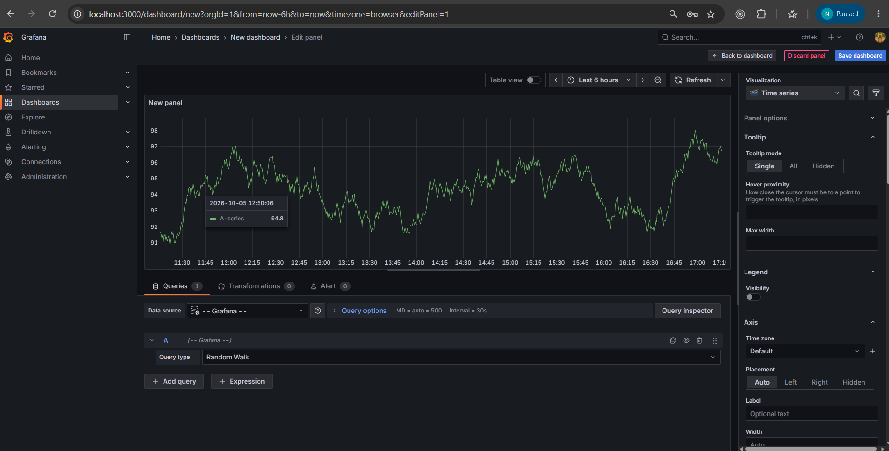

## Queries
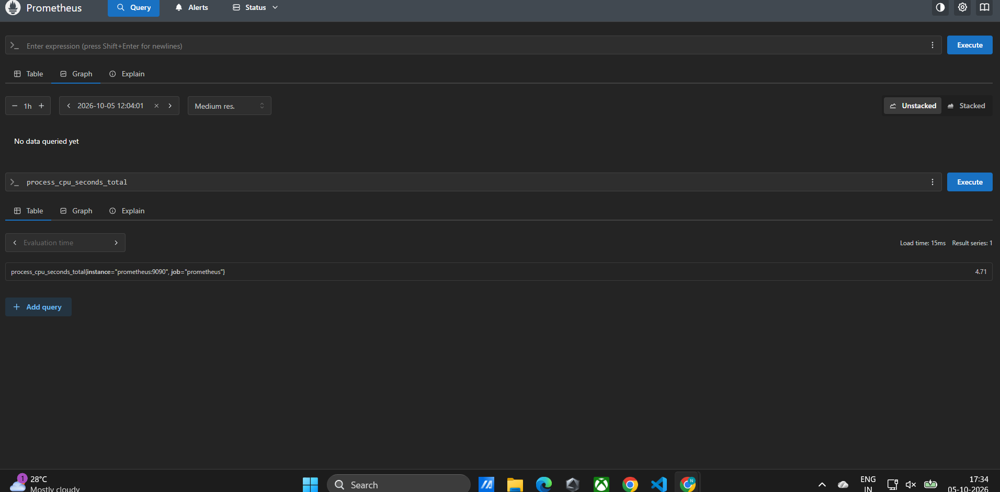
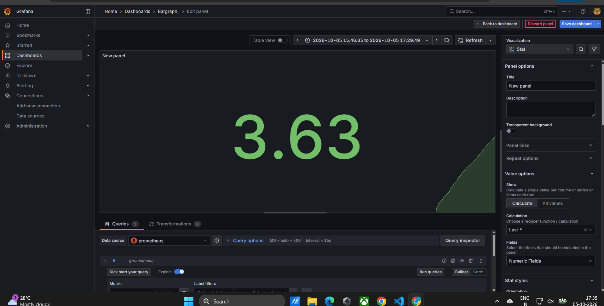

## Grafana dashboard:
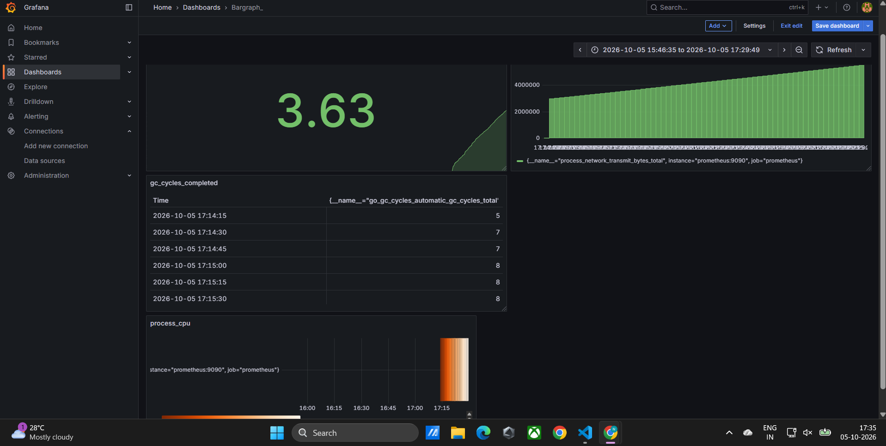

## kind_installation , and creating the cluster :
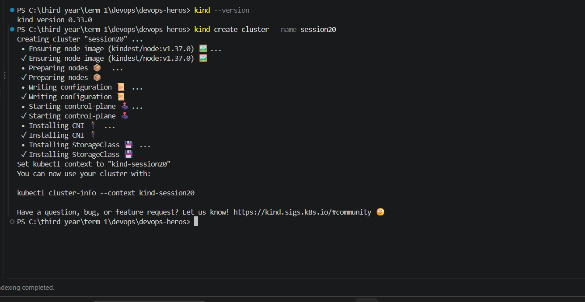

## verifying its running :
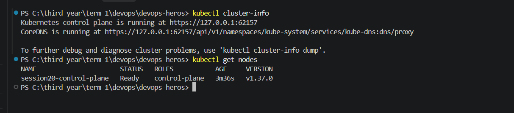

## Install Argo CD:
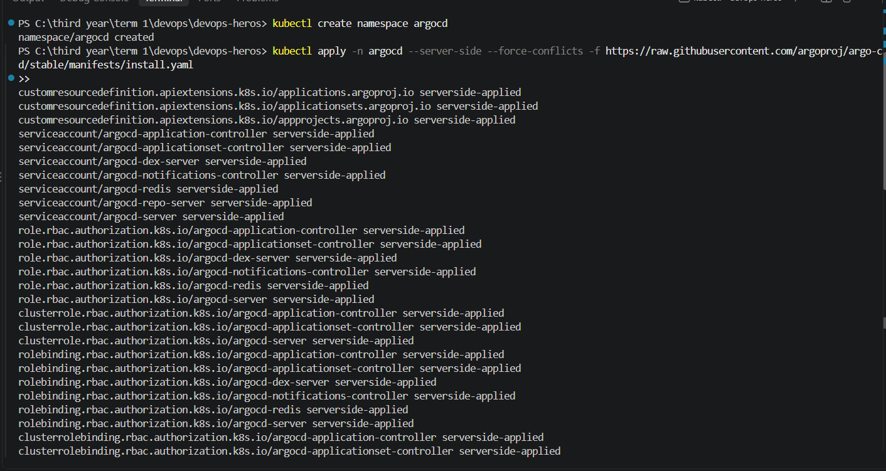

## All_running :
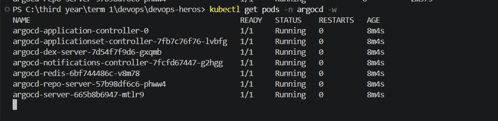

## port forwarding :
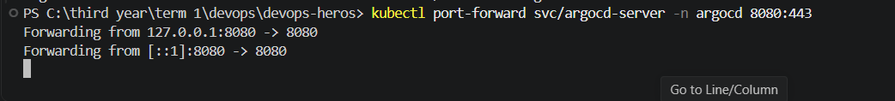

## argocd _ Dashboard:
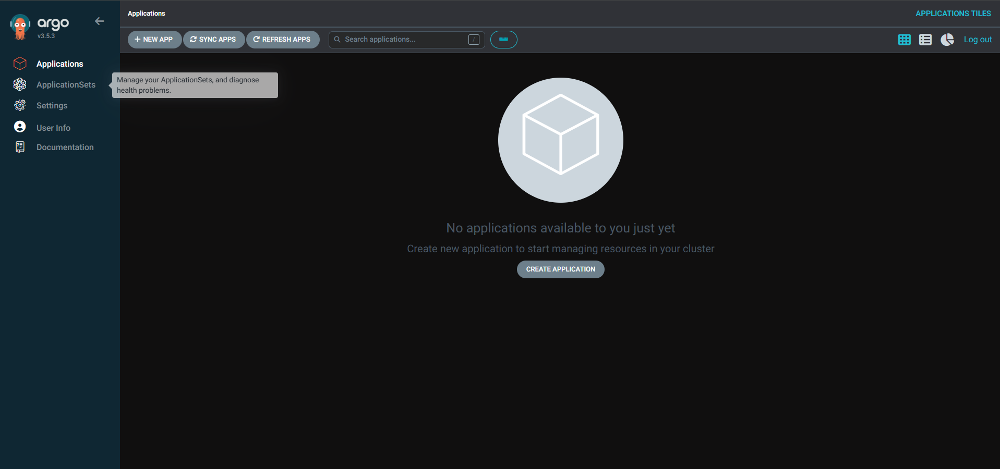

## My argocd deployment :
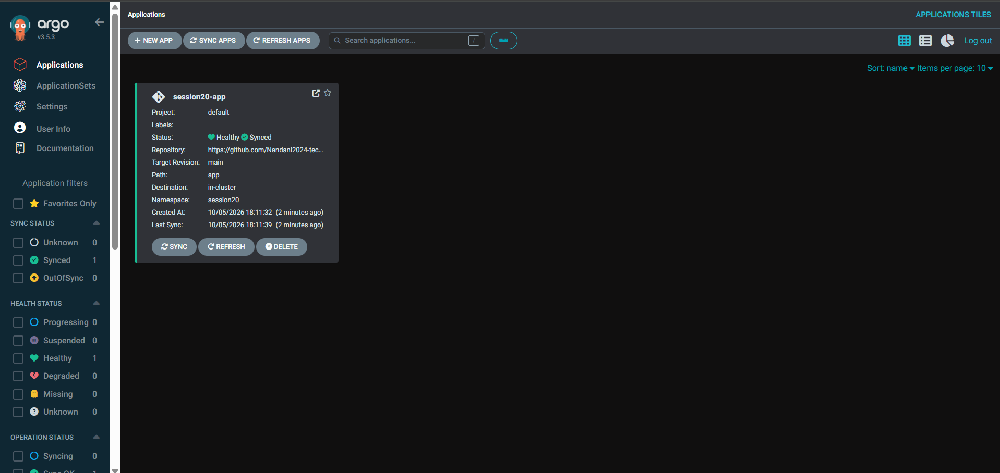

## Health check and verification :
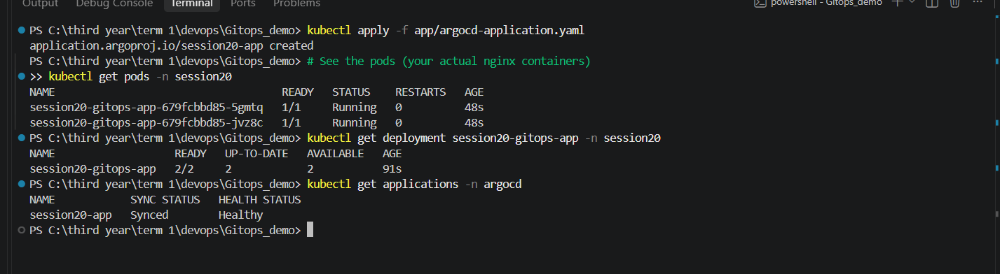

## current replicas :
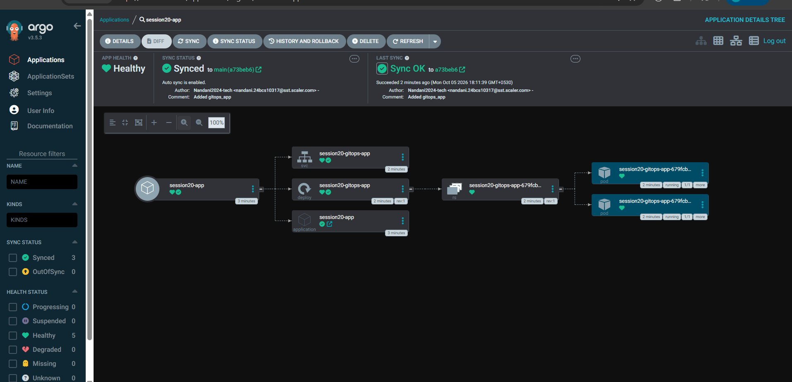

## updated the replicas :
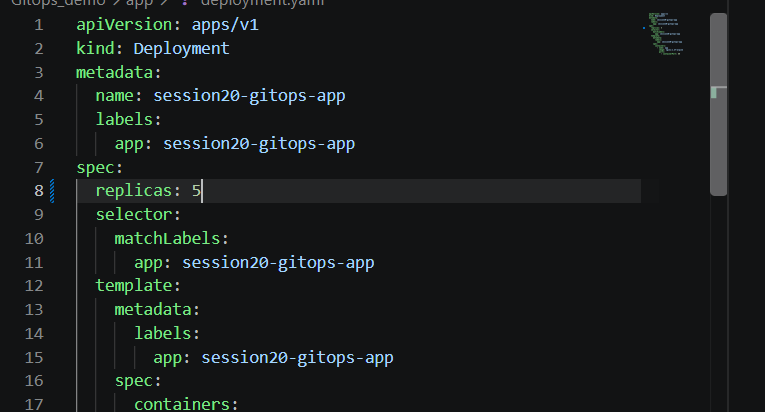

## pushed :
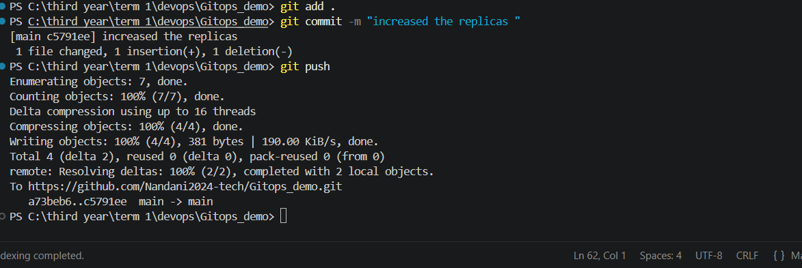

## Updated :
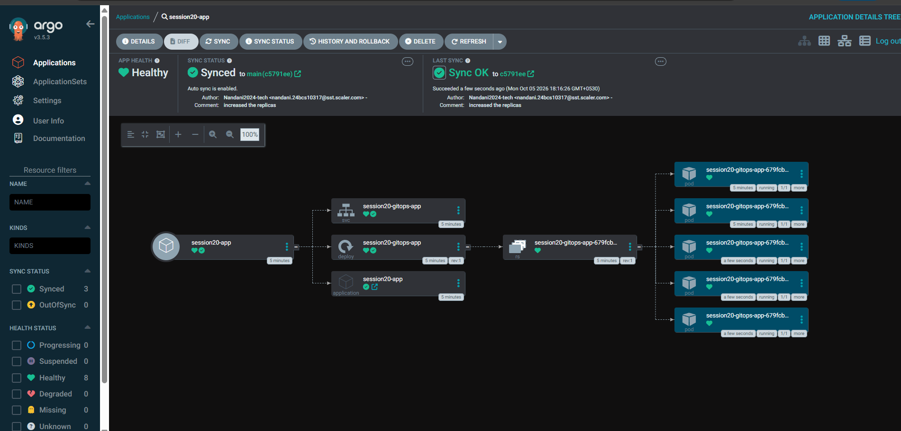