# Creating and port-forwarding service :

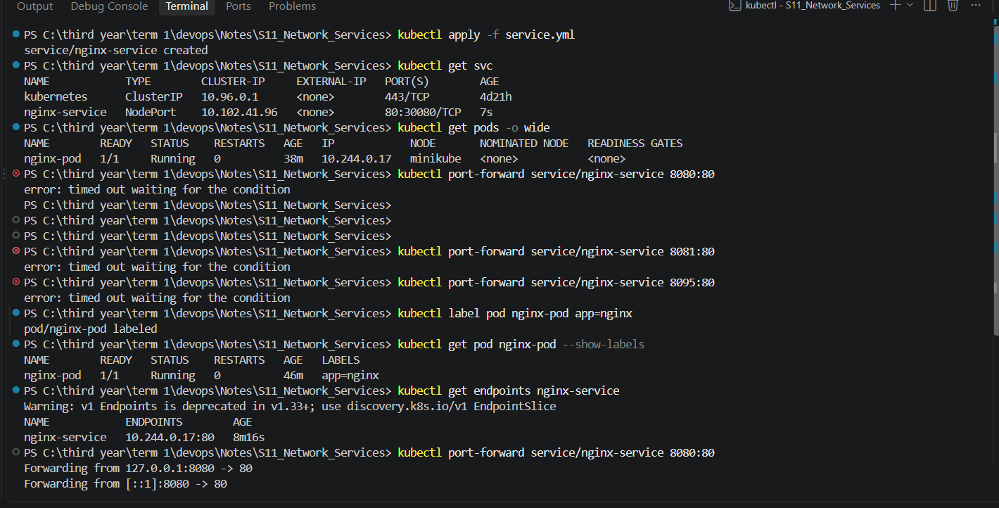

## Ran replicaset :

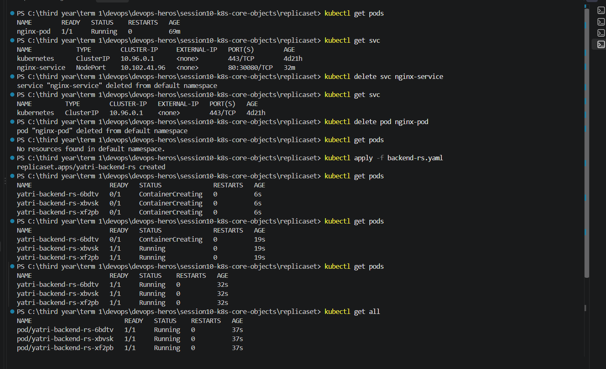

## Scaling replicaset :

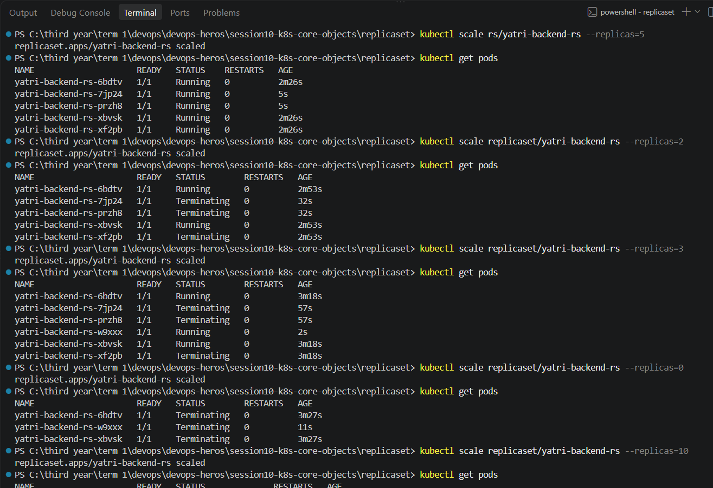
### After sometime 
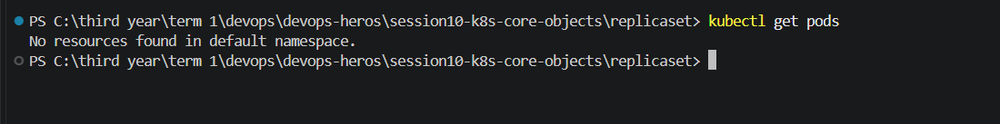

## Deleting RS :
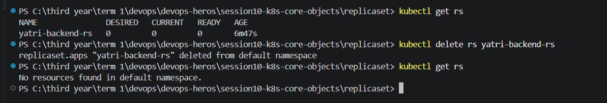

## Runnning deployement:

### V1 :
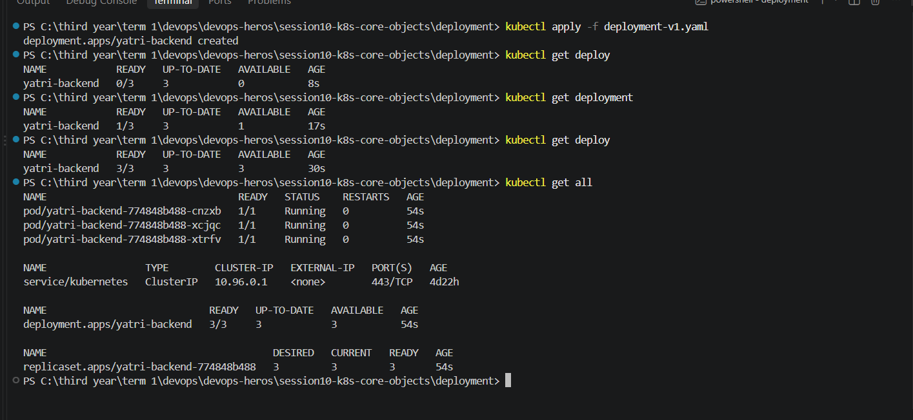

### v2 :
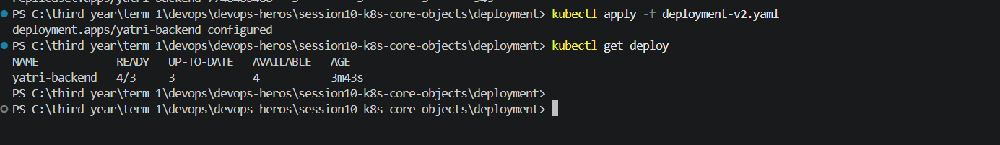

## creating replicas of deployment :

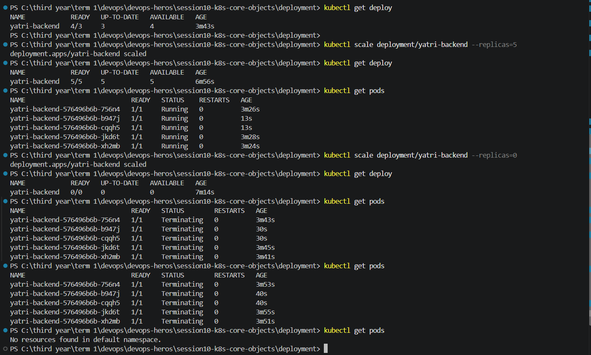

# Running POD Lifecycle 

## 01-running.yaml :

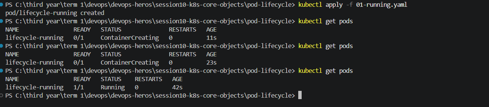

## 02-pending.yaml :
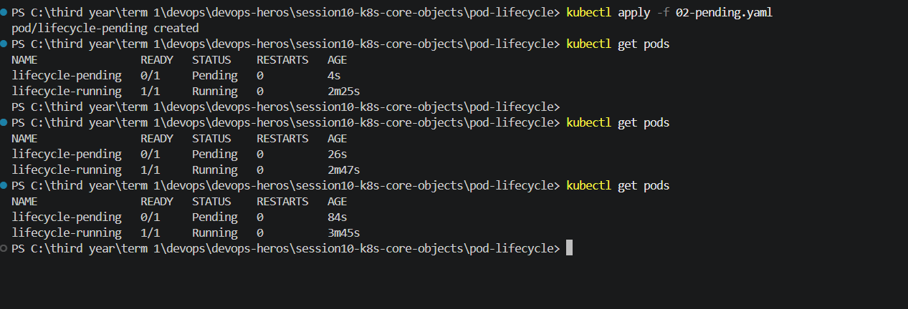

## 03-succeeded.yaml
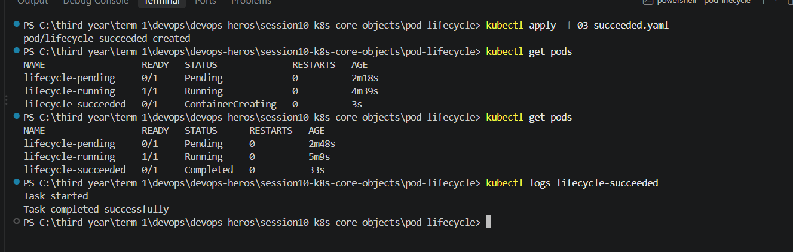

## 04-failed.yaml : 
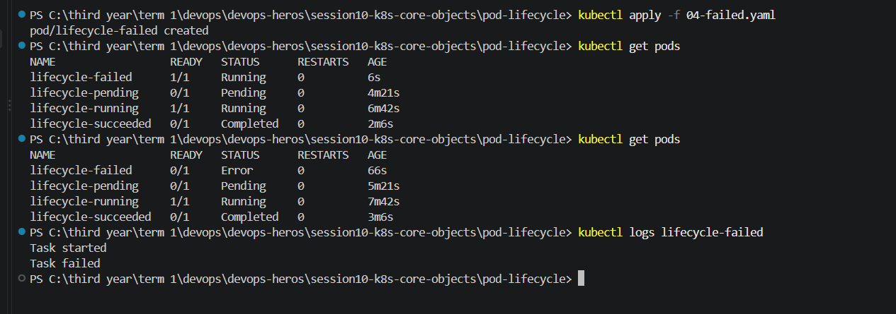

## 05-crashloopbackoff.yaml :
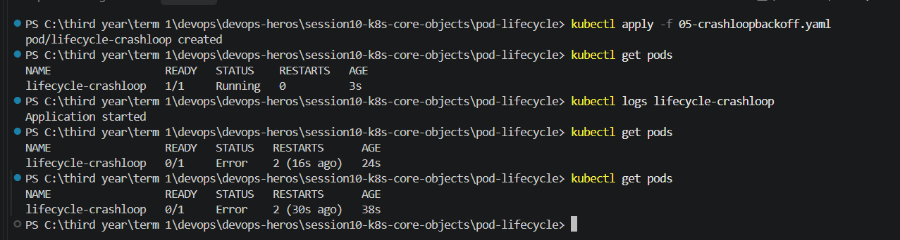

## 06-imagepullbackoff.yaml:
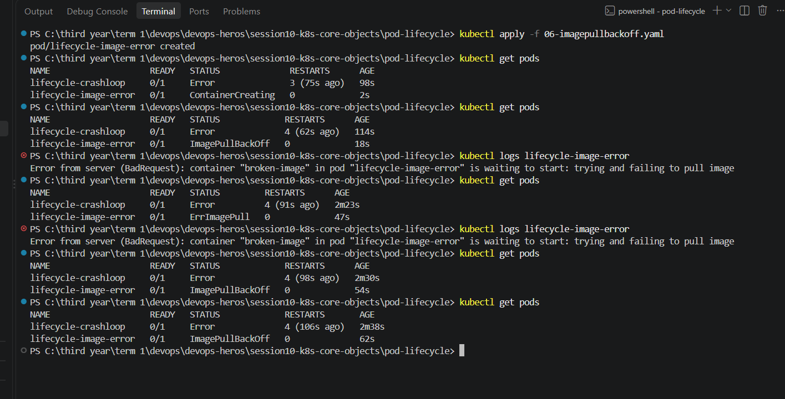

## 07-readiness.yaml :
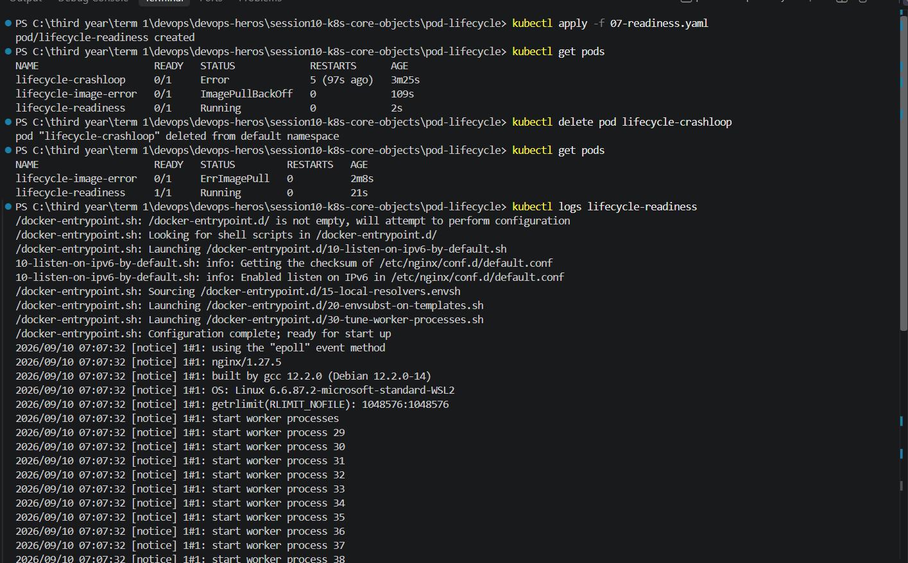 

## 08-liveness.yaml: 
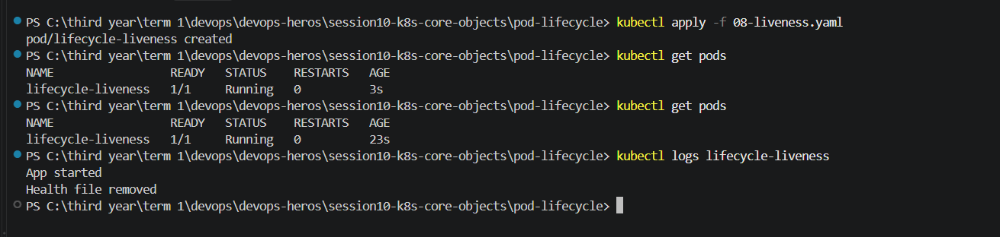

## 09-startup.yaml :
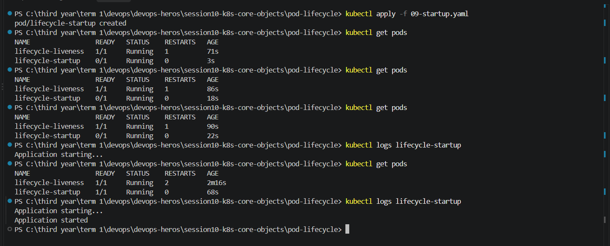

## 10-init-container.yaml :
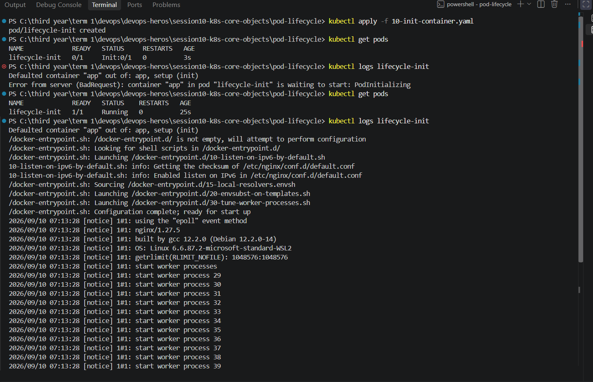 

## 11-multi-container.yaml :
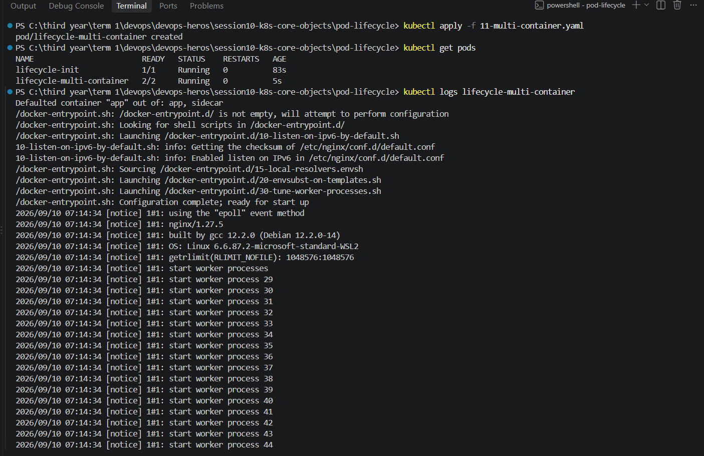

## 12-termination.yaml:
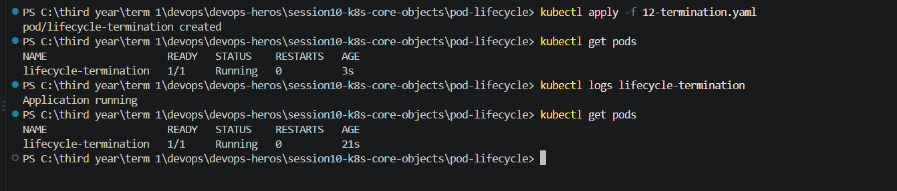
